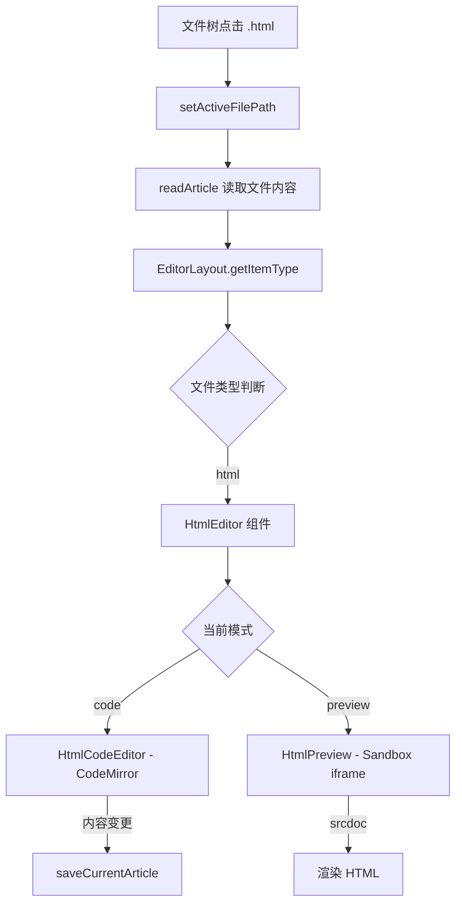
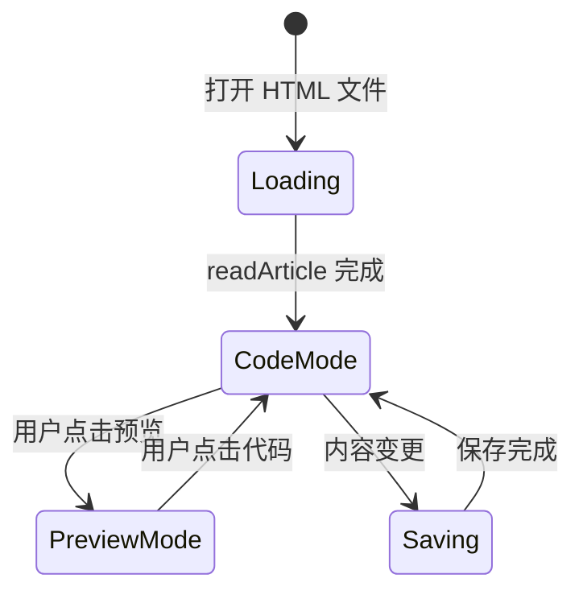

# Design Document: HTML Editor Support

## Overview

本设计为 LingMo 笔记应用添加 HTML 文件编辑支持。用户可以在编辑器中打开 `.html`/`.htm` 文件，在代码模式（CodeMirror 语法高亮编辑）和预览模式（沙箱 iframe 渲染）之间切换。

### 设计目标

- 复用现有的文件读写流程（`readArticle` / `saveCurrentArticle`）和 Tab 管理机制
- 使用 CodeMirror 6 提供 HTML 语法高亮和代码编辑能力
- 通过 sandbox iframe 安全渲染 HTML 预览，隔离主应用环境
- 组件结构与现有编辑器（markdown、diagram、pdf）保持一致的模式

### 关键设计决策

| 决策 | 选择 | 理由 |
|------|------|------|
| 代码编辑器 | CodeMirror 6 | 项目已有 `@codemirror/commands` 依赖，生态成熟，支持 HTML 语言模式 |
| 预览渲染 | sandbox iframe + srcdoc | 安全隔离，无需额外服务，`srcdoc` 支持直接注入 HTML 内容 |
| 状态管理 | 组件内部 useState | 模式切换和编辑内容为局部状态，无需全局 store 扩展 |
| 文件路由 | 扩展 `getItemType` 函数 | 与现有 PDF、Image、Diagram 路由模式一致 |
| 保存机制 | 复用 `saveCurrentArticle` | 保持与 markdown 编辑器一致的防抖保存和同步推送行为 |

## Architecture



### 集成点

1. **EditorLayout** (`editor-layout.tsx`): 添加 `html` 类型识别，从 `MARKDOWN_EXTENSIONS` 中移除 `html`，新增 `HTML_EXTENSIONS` 集合
2. **Article Store** (`stores/article.ts`): 无需修改，`readArticle` 已支持读取任意文本文件，`saveCurrentArticle` 通用于所有文本内容保存
3. **Tab Bar** (`tab-bar.tsx`): 无需修改，Tab 管理已通用化

## Components and Interfaces

### 文件结构

```
src/app/core/main/editor/html/
├── html-editor.tsx          # 主容器组件，管理模式切换
├── html-code-editor.tsx     # CodeMirror 代码编辑器
└── html-preview.tsx         # Sandbox iframe 预览
```

### 组件接口

```typescript
// html-editor.tsx - 主容器
interface HtmlEditorProps {
  filePath: string
  tabContentsRef: RefObject<Record<string, string>>
}

// html-code-editor.tsx - 代码编辑
interface HtmlCodeEditorProps {
  content: string
  onChange: (value: string) => void
}

// html-preview.tsx - 预览渲染
interface HtmlPreviewProps {
  content: string
}
```

### HtmlEditor 组件行为

```typescript
type EditorMode = 'code' | 'preview'

// HtmlEditor 内部状态
// - mode: EditorMode (默认 'code')
// - content: string (当前编辑内容，从 store 的 currentArticle 初始化)
// - isLoading: boolean
```

### EditorLayout 修改

```typescript
// 新增常量
const HTML_EXTENSIONS = new Set(['html', 'htm'])

// 修改 MARKDOWN_EXTENSIONS：移除 'html'
const MARKDOWN_EXTENSIONS = new Set([
  'md', 'txt', 'markdown', 'py', 'js', 'ts', 'jsx', 'tsx', 'css', 'scss', 'less',
  'xml', 'json', 'yaml', 'yml', 'sh', 'bash', 'java', 'c', 'cpp', 'h', 'go',
  'rs', 'sql', 'rb', 'php', 'vue', 'svelte', 'astro', 'toml', 'ini', 'conf', 'cfg',
  'gitignore', 'env', 'example', 'template'
])

// getItemType 函数扩展
// 在 MARKDOWN_EXTENSIONS 检查之前添加 HTML_EXTENSIONS 检查
if (HTML_EXTENSIONS.has(extension)) {
  return 'html'
}
```

### CodeMirror 配置

需要安装的新依赖：
- `@codemirror/lang-html` — HTML 语言支持（语法高亮、自动补全）
- `@codemirror/view` — 编辑器视图
- `@codemirror/state` — 编辑器状态管理
- `codemirror` — 基础包（包含 basicSetup）

```typescript
// html-code-editor.tsx 中的 CodeMirror 配置
import { EditorView, basicSetup } from 'codemirror'
import { html } from '@codemirror/lang-html'
import { EditorState } from '@codemirror/state'

const extensions = [
  basicSetup,
  html(),
  EditorView.lineWrapping,
  EditorView.theme({
    '&': { height: '100%' },
    '.cm-scroller': { overflow: 'auto' },
  }),
  EditorView.updateListener.of((update) => {
    if (update.docChanged) {
      onChange(update.state.doc.toString())
    }
  }),
]
```

### Sandbox iframe 配置

```typescript
// html-preview.tsx
<iframe
  srcDoc={content}
  sandbox="allow-same-origin"
  // 不包含 allow-scripts, allow-popups 等权限
  // 仅 allow-same-origin 用于 CSS 正常渲染
  className="w-full h-full border-0 bg-white"
  title="HTML Preview"
/>
```

`sandbox` 属性策略：
- `allow-same-origin`: 允许 CSS 样式正常工作
- **不包含** `allow-scripts`: 禁止 JavaScript 执行
- **不包含** `allow-popups`: 禁止弹窗
- **不包含** `allow-forms`: 禁止表单提交

## Data Models

### 状态流转



### 数据流

1. **加载流程**: `setActiveFilePath(path)` → `readArticle(path)` → `set({ currentArticle: content })` → `HtmlEditor` 通过 `useArticleStore` 获取 `currentArticle` 初始化本地 `content` 状态

2. **编辑流程**: 用户编辑 → CodeMirror `updateListener` → `onChange(newContent)` → 更新本地 `content` 状态 → 调用 `saveCurrentArticle(newContent)` 触发防抖保存

3. **模式切换**: 用户点击 Mode Toggle → 更新 `mode` 状态 → 预览模式使用当前 `content` 渲染 iframe

4. **Tab 切换恢复**: Tab 切回 → `readArticle` 重新读取 → `currentArticle` 更新 → `HtmlEditor` 检测到 `filePath` 对应的内容变化 → 重新初始化

### 与现有 Store 的交互

```typescript
// HtmlEditor 使用的 store 字段
const {
  currentArticle,      // 文件内容（由 readArticle 填充）
  saveCurrentArticle,  // 保存文件（防抖 + 同步推送）
  activeFilePath,      // 当前活动文件路径
  isPulling,           // 是否正在从远程拉取
} = useArticleStore()
```

不需要扩展 store 接口，所有需要的字段和方法已存在。

## Correctness Properties

*A property is a characteristic or behavior that should hold true across all valid executions of a system—essentially, a formal statement about what the system should do. Properties serve as the bridge between human-readable specifications and machine-verifiable correctness guarantees.*

### Property 1: HTML 文件路由正确性

*For any* file path with a `.html` or `.htm` extension, the `getItemType` function SHALL return `'html'`; and for any file path with an extension in the original MARKDOWN_EXTENSIONS set (excluding `html`), it SHALL NOT return `'html'`.

**Validates: Requirements 1.1, 1.2**

### Property 2: 文件内容读写往返一致性

*For any* valid string content, writing it via `saveCurrentArticle` to a given file path and then reading it back via `readWorkspaceTextFile` from the same path SHALL produce an identical string.

**Validates: Requirements 1.3, 2.4**

### Property 3: 编辑器内容状态同步

*For any* string input dispatched as a document change in the CodeMirror editor, the `onChange` callback SHALL be invoked with the complete updated document content reflecting that change.

**Validates: Requirements 2.3**

### Property 4: 预览模式反映当前内容

*For any* HTML content string held in the editor's internal state, when the editor is in preview mode, the iframe's `srcdoc` attribute SHALL equal that content string exactly.

**Validates: Requirements 3.1, 3.3**

### Property 5: 模式切换保留编辑内容

*For any* HTML content in the editor, switching from code mode to preview mode and back to code mode SHALL preserve the content unchanged (round-trip identity).

**Validates: Requirements 4.2, 4.3, 4.5**

### Property 6: Tab 切换恢复编辑器状态

*For any* HTML editor with content `C` and mode `M`, switching to another tab and switching back SHALL restore both the content to `C` and the mode to `M`.

**Validates: Requirements 5.3**


## Error Handling

### 文件读取失败

| 场景 | 处理方式 |
|------|----------|
| 文件不存在 | 由 `readArticle` 现有逻辑处理，显示空内容或尝试远程拉取 |
| 文件编码异常 | `readTextFile` 默认 UTF-8 解码，非 UTF-8 文件可能显示乱码，不阻塞编辑器加载 |
| 文件读取权限不足 | 捕获异常，设置 `loading: false`，编辑器显示空状态 |

### 文件保存失败

| 场景 | 处理方式 |
|------|----------|
| 磁盘空间不足 | `saveCurrentArticle` 现有 try-catch 处理，保留内存中的编辑内容不丢失 |
| 文件被外部锁定 | 同上，保存失败不影响编辑器状态 |
| 路径不存在 | `saveCurrentArticle` 已有目录自动创建逻辑 |

### CodeMirror 初始化失败

- 如果 CodeMirror 扩展加载失败，捕获异常并显示 fallback 的纯文本 `<textarea>`
- 记录错误到 console，不阻塞用户编辑

### 预览渲染异常

- iframe `srcdoc` 注入的 HTML 如果包含语法错误，浏览器会尽力渲染（graceful degradation）
- sandbox 属性确保即使 HTML 包含恶意脚本也不会执行
- iframe 加载失败时显示 "预览不可用" 提示文本

## Testing Strategy

### 单元测试

使用项目现有的测试框架，针对以下场景编写 example-based 测试：

1. **文件类型识别**
   - `getItemType('notes/page.html')` 返回 `'html'`
   - `getItemType('notes/page.htm')` 返回 `'html'`
   - `getItemType('notes/page.md')` 返回 `'markdown'`（确认 html 已从 markdown 集合移除）

2. **组件渲染**
   - HtmlEditor 默认以 code 模式渲染
   - HtmlEditor 在 code 模式下渲染 CodeMirror 编辑器
   - HtmlEditor 在 preview 模式下渲染 iframe
   - Mode Toggle 控件始终可见

3. **Sandbox 安全配置**
   - iframe 包含 `sandbox="allow-same-origin"` 属性
   - iframe 不包含 `allow-scripts`

### 属性测试 (Property-Based Testing)

使用 `fast-check` 库，每个属性测试运行最少 100 次迭代。

**测试库**: `fast-check` (TypeScript property-based testing)

**配置**:
- 最少 100 次迭代
- 每个测试标注对应的设计属性

**标注格式**: `Feature: html-editor-support, Property {number}: {property_text}`

**属性测试覆盖**:

| Property | 测试策略 | 生成器 |
|----------|----------|--------|
| Property 1 | 生成随机文件路径 + 扩展名，验证路由结果 | `fc.record({ name: fc.string(), ext: fc.constantFrom('html', 'htm', 'md', 'txt', ...) })` |
| Property 2 | 生成随机 HTML 字符串，写入后读取验证一致性 | `fc.string()` (需 mock Tauri fs API) |
| Property 3 | 生成随机字符串作为文档变更，验证 onChange 回调参数 | `fc.string()` |
| Property 4 | 生成随机 HTML 内容，验证 iframe srcdoc 属性 | `fc.string()` |
| Property 5 | 生成随机内容，执行 code→preview→code 切换，验证内容不变 | `fc.string()` |
| Property 6 | 生成随机内容和模式，模拟 tab 切换，验证状态恢复 | `fc.record({ content: fc.string(), mode: fc.constantFrom('code', 'preview') })` |

### 集成测试

- Tab 创建：打开 HTML 文件后 Tab 栏出现对应标签
- Tab 关闭：关闭 HTML Tab 后 `tabContentsRef` 中对应条目被清理
- 与同步推送的集成：编辑 HTML 文件后触发远程同步（如已配置）

### 测试环境注意事项

- Tauri 文件系统 API 需要 mock（`@tauri-apps/plugin-fs`）
- CodeMirror 需要 DOM 环境（使用 jsdom 或 happy-dom）
- iframe sandbox 行为在 jsdom 中不完全模拟，安全属性测试仅验证 DOM 属性值
