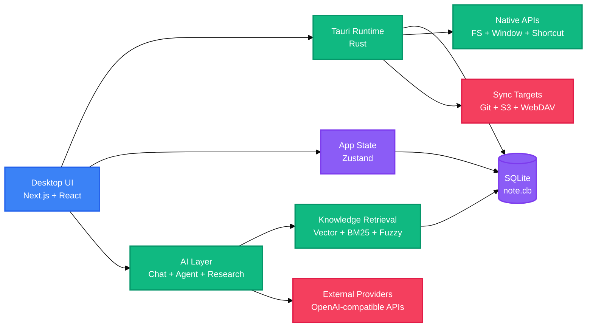

<!-- BEAUTIFIED -->

<p align="center">
  <a href="README.md">English</a> · 中文
</p>

<h1 align="center">LingMo</h1>
<p align="center">
  <strong>面向捕获、写作、AI 协作和本地知识检索的跨平台 Markdown 工作区。</strong>
  <br />
  <em>Next.js · React · Tauri v2 · SQLite · RAG · MCP · Skills</em>
</p>

<p align="center">
  <a href="#快速开始"></a>
  <a href="LICENSE"></a>
</p>

<p align="center">
  
  
  
  
  
  
  
</p>

## 功能特性

| 功能 | 说明 |
|---|---|
| Markdown 工作区 | 通过 Tauri 桌面外壳管理本地 Markdown 笔记、附件、图表、PDF 和写作素材。 |
| AI 协作 | 通过 OpenAI 兼容服务和本地工具编排提供 Chat、Agent 和 Deep Research 模式。 |
| 知识检索 | 使用向量搜索、BM25 打分、模糊匹配和可选重排构建本地 RAG 层。 |
| 捕获收集箱 | 在整理前先收集文本、智能链接、截图、语音备忘、本地文件和快捷待办。 |
| 同步与备份 | 支持 GitHub、Gitee、GitLab、Gitea、S3 兼容存储和 WebDAV 同步路径。 |
| 可扩展工具 | 包含 MCP 集成、本地 Skills 执行、图表工具、输出工作坊流程和 Agent Harness 模块。 |

LingMo 基于开源项目 [NoteGen](https://github.com/codexu/note-gen) 构建。本仓库在原始基础上调整了 LingMo 品牌、发布链接、RAG 能力、AI 请求处理和项目文档。

## 快速开始

### 环境要求

```bash
node --version
pnpm --version
cargo --version
```

桌面开发还需要安装当前操作系统对应的 Tauri v2 系统依赖。

### 安装

```bash
pnpm install
```

### 启动桌面开发模式

```bash
pnpm tauri dev
```

### 构建

```bash
pnpm build
pnpm tauri build
```

## 使用方法

### 启动浏览器预览

```bash
pnpm dev
```

浏览器预览适合 UI 开发，但完整的本地文件、SQLite、快捷键、更新器和桌面集成路径需要 Tauri 运行时。

### 运行项目检查

```bash
pnpm check
```

### 构建文档站

```bash
pnpm docs:build
```

### 构建 Windows 安装包

```bash
pnpm sync-version
pnpm tauri build --bundles nsis
```

## 架构

LingMo 是一个有状态的桌面应用，由 Next.js UI、Tauri/Rust 原生层、本地 SQLite 存储以及可选的外部 AI 和同步服务组成。



## 配置

### 环境变量

| 变量 | 说明 | 默认值 |
|---|---|---|
| `TAURI_DEV_HOST` | 在 `next.config.ts` 中为 Next.js 开发服务器添加允许的开发来源。 | `127.0.0.1`, `localhost` |
| `NEXT_DEV_PORT` | `scripts/next-dev.mjs` 使用的端口。 | `3457` |
| `NEXT_DEV_HOST` | `scripts/next-dev.mjs` 使用的主机。 | `0.0.0.0` |
| `OPENROUTER_API_KEY` | 配置后用于 OpenRouter 兼容 AI 访问的本地 API Key。 | — |
| `NEXT_PUBLIC_UPGRADE_API_URL` | 事件上报使用的公开 UpgradeLink API 端点。 | `https://api.upgrade.toolsetlink.com` |
| `NEXT_PUBLIC_UPGRADE_ACCESS_KEY` | 事件上报使用的公开 UpgradeLink Access Key。 | — |
| `NEXT_PUBLIC_UPGRADE_APP_KEY` | 事件上报使用的公开 UpgradeLink 应用 Key。 | — |
| `UPGRADE_SECRET_KEY` | 事件上报使用的服务端 UpgradeLink 签名密钥。 | — |

### Tauri 更新器

| 文件 | 用途 |
|---|---|
| `src-tauri/tauri.conf.json` | 定义产品元数据、打包目标、图标、更新端点和更新器公钥。 |
| `.github/workflows/release.yml` | 从 `release` 分支构建桌面和 Android 发布产物。 |

更新器签名需要在发布环境中配置 `TAURI_SIGNING_PRIVATE_KEY`，如有密码还需要配置 `TAURI_SIGNING_PRIVATE_KEY_PASSWORD`。

## 项目结构

```text
LingMo/
├── src/
│   ├── app/               # Next.js app routes for desktop and mobile surfaces
│   ├── components/        # Shared UI components and feature panels
│   ├── db/                # SQLite table initialization and data access modules
│   ├── lib/               # AI, RAG, sync, MCP, Skills, diagrams, speech, and utilities
│   └── stores/            # Zustand stores for application state
├── src-tauri/
│   ├── src/               # Rust entry points and native Tauri integration
│   ├── icons/             # Desktop and mobile app icons
│   └── tauri.conf.json    # Tauri v2 application configuration
├── docs/
│   ├── app/               # Standalone documentation site pages
│   ├── components/        # Documentation site components
│   └── package.json       # Documentation package scripts and dependencies
├── messages/              # Internationalized UI message catalogs
├── public/                # Static assets and bundled Draw.io resources
├── scripts/               # Development, version sync, and test helper scripts
├── skills/                # Local application skills bundled with the project
├── package.json           # Workspace scripts and frontend dependencies
└── pnpm-workspace.yaml    # pnpm workspace definition for app and docs
```

## 技术栈

### 应用

| 技术 | 用途 |
|---|---|
| Next.js 15 | 应用外壳、静态导出和文档站框架。 |
| React 19 | 桌面端、移动端和文档页面的 UI 组件模型。 |
| TypeScript | 为应用和文档工作区提供静态类型检查。 |
| Tailwind CSS | 应用和文档包的样式系统。 |
| Tauri v2 | 原生桌面运行时、打包、更新器和操作系统集成。 |
| Rust | 通过 Tauri 插件提供原生数据库、文件、同步、窗口和平台支持。 |

### 数据与 AI

| 技术 | 用途 |
|---|---|
| SQLite | 通过 `@tauri-apps/plugin-sql` 和 `rusqlite` 提供本地数据库。 |
| Zustand | 客户端状态管理。 |
| Tiptap | 富文本 Markdown 编辑基础。 |
| OpenAI SDK | OpenAI 兼容的聊天、补全、Embedding 和模型服务流程。 |
| ECharts / Mermaid / Draw.io | 可视化报告、图表和图形创作路径。 |
| MCP / Skills | 为 Agent 提供外部工具调用和本地技能执行能力。 |

### 构建与质量

| 技术 | 用途 |
|---|---|
| pnpm | 工作区包管理。 |
| Cargo | Rust 依赖和原生构建管理。 |
| ESLint | 通过 `next lint` 执行源码检查。 |
| TypeScript compiler | 通过 `tsc --noEmit` 执行静态类型验证。 |
| GitHub Actions | 通过 `.github/workflows/release.yml` 发布构建产物。 |

## 部署

### 桌面端发布

```bash
pnpm sync-version
pnpm tauri build
```

推送到 `release` 分支会触发发布工作流。该流程发布 Tauri 桌面端包，并使用 `lingmo-v__VERSION__` 作为 Release tag 格式。

### 文档站

```bash
pnpm install
pnpm docs:build
```

文档站位于 `docs/`，是独立的 Next.js 项目。在 Vercel 中部署时，将根目录设为 `docs`，构建命令设为 `pnpm build`，输出目录设为 `out`。

## 贡献

1. Fork 本仓库。
2. 创建一个范围明确的功能分支。
3. 提交前运行 `pnpm check`。
4. 使用清晰的提交信息说明改动原因。
5. 向相关分支打开 Pull Request。

## 许可证

[GPL-3.0](LICENSE)
