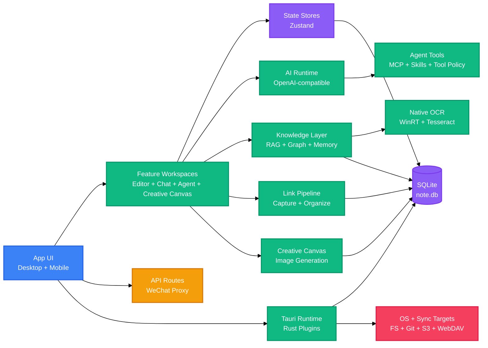

<!-- BEAUTIFIED -->

<p align="center">
  <a href="README.md">English</a> · 中文
</p>

<h1 align="center">LingMo</h1>
<p align="center">
  <strong>面向采集、写作、AI 协作与本地知识检索的跨平台 Markdown 工作台。</strong>
  <br />
  <em>Next.js · React · Tauri v2 · SQLite · RAG · MCP · Skills · 桌面端与移动端</em>
</p>

<p align="center">
  <a href="#快速开始"></a>
  <a href="LICENSE"></a>
</p>

<p align="center">
  
  
  
  
  
  
  
  
</p>

<p align="center">
  
  
</p>

## 功能特性

| 功能 | 说明 |
|---|---|
| 本地 Markdown 工作区 | 在 Tauri 桌面外壳中管理文件笔记、附件、图表、PDF、标签、收藏与编辑器标签页。 |
| AI 写作与对话 | 提供 OpenAI 兼容的对话、补全、翻译、改写、语音润色、视觉桥接、提示词增强、会话连续性识别与供应商模板。 |
| 创意画布 | 基于节点的无限画布，用于 AI 图片生成工作流:排布提示词、配置、图片节点并连接成管线，调用任意 OpenAI 兼容图像模型生成，结果可在笔记中复用。 |
| Agent 与工具运行时 | 通过本地工具、MCP Server、Skills、记忆、任务规划、意图感知工具策略、只读批量执行、循环守卫与对话记忆排序驱动 Agent 操作。 |
| 知识检索与工作流 | 将笔记、图表、结构化知识、主题、关系、记忆和知识对象纳入基于 SQLite 的本地查询流程，并提供批量打标签、frontmatter 规范化与增量重建的 Agent 工具。 |
| 链接采集管线 | 持久、崩溃安全的作业管线:把链接抓取成 mark，按来源类型路由，可选地通过 AI 整理重写为结构化 Markdown 资料卡，整理过程支持冲突感知。 |
| 原生 OCR 与微信采集 | 可配置 OCR，原生 Windows(WinRT)引擎优先、Tesseract 回退;加固的微信文章/图片抓取，支持多次尝试抓取与严格的域名重定向白名单。 |
| 采集与输出工坊 | 支持文本、链接、图片、截图、识别结果、录音和待办采集，并导出文章、演示、报告、卡片和图表。 |
| 同步与发布路径 | 支持 GitHub、Gitee、GitLab、Gitea、S3 兼容存储、WebDAV、桌面打包、更新元数据和 Android 产物。 |

LingMo 基于开源项目 [NoteGen](https://github.com/codexu/note-gen) 构建。本仓库在原有基础上加入 LingMo 品牌、Tauri v2 发布基础设施、本地 AI 请求处理、面向 RAG 的知识模块、MCP 集成、Skills 与独立文档站。

## 快速开始

### 前置条件

```bash
node --version
pnpm --version
cargo --version
```

桌面端开发还需要安装目标操作系统对应的 Tauri v2 系统依赖。

### 安装依赖

```bash
pnpm install
```

### 启动桌面开发环境

```bash
pnpm tauri dev
```

### 构建

```bash
pnpm build
pnpm tauri build
```

## 使用方法

### 启动 Next.js 浏览器壳

```bash
pnpm dev
```

浏览器壳适合 UI 开发。原生文件访问、SQLite、快捷键、通知、更新器和平台集成需要在 Tauri 运行时中验证。

### 启动桌面开发包装器

```bash
pnpm dev:launch
```

`scripts/start-lingmo-dev.mjs` 会启动或复用 Next.js 开发服务器，预热关键路由，并在已有 debug Tauri 可执行文件时直接拉起桌面应用。

### 运行项目检查

```bash
pnpm check                       # typecheck + lint
pnpm test:agent                  # Agent 运行时核心
pnpm test:structured-knowledge   # 结构化知识抽取与队列
pnpm test:output-workshop        # 输出导出流程
pnpm test:creative-canvas        # 创意画布生成与数据库
pnpm test:db-runtime             # 链接管线下数据库运行时
pnpm test:wechat-ocr             # 微信抓取与 OCR 回归
```

其他定向脚本覆盖 GitHub stars、AI 热点、网页提取、Draw.io XML、Draw.io 工具暴露和 research evaluation。可用 `pnpm test:<name>` 运行单个套件,或一次性全部跑完:

```bash
pnpm test:agent && pnpm test:creative-canvas && pnpm test:db-runtime && pnpm test:wechat-ocr && pnpm test:structured-knowledge
```

### 开发文档站

```bash
pnpm docs:dev
pnpm docs:build
pnpm docs:typecheck
```

文档站是 `docs/` 下的独立包，并在 `pnpm-workspace.yaml` 中纳入 workspace。

## 架构

LingMo 是一个有状态桌面应用。Next.js/React UI 负责工作区交互，Tauri/Rust 层提供原生能力，SQLite 在本地存储应用、知识、Agent 和同步数据。



## 功能详解

### 创意画布

基于节点的无限画布,用于设计与运行 AI 图片生成工作流。在可自由平移/缩放的画布上排布**文本提示词**、**配置**和**图片**节点,把它们连接成生成管线(提示词 → 配置 → 生成图片,并支持参考图回流到图像编辑流程),调用应用中配置的任意 OpenAI 兼容图像模型执行生成。

- **节点图**:有向边让配置节点从上游文本节点读取提示词、从上游图片节点读取参考图,同时支持生成与编辑两种流程。
- **生成作业**:状态跟踪(queued / running / succeeded / failed / cancelled / stale),支持重启后恢复卡住的作业以及重试失败作业。
- **素材库**:延迟生成缩略图,支持拖拽导入、加入画布、插入笔记,以及查找无用素材并回收磁盘空间的清理工具。
- **快照导入导出**:把整张画布图导出为 JSON,也可导入 `basketikun/infinite-canvas` 风格的 JSON 创建新项目。
- **Agent 驱动**:约 25 个 `creative_canvas_*` / `canvas_*` 工具(同时发布为 MCP schema),让应用内 Agent 或外部 MCP 客户端无需打开 UI 即可构建流程、运行生成并把素材插入笔记。入口:创意画布标签页、侧边栏面板或来自对话的 `open-creative-canvas` 事件。

数据落库覆盖五张 SQLite 表(`creative_canvas_projects`、`creative_canvas_nodes`、`creative_canvas_edges`、`creative_canvas_assets`、`creative_generation_jobs`),带 schema 版本管理。生成的图片存放在 `AppData/creative-canvas/assets` 下。

### 链接采集管线

保存链接时不再就地抓取和整理,而是把请求作为**持久作业**入队:抓取页面存为 mark、按来源类型路由,并(可选地)通过一次 AI 整理重写为结构化 Markdown 资料卡。作业是崩溃安全的:租约、检查点、重试和自动恢复扫描保证抓取或整理步骤中断后重启可续跑,且即使 AI 步骤失败也不会丢失原文。

管线位于 `src/lib/link-pipeline/`,状态通过 `src/db/link-pipeline.ts` 持久化。阶段依次为 `capture → extract → organize → render → complete`:

| 层 | 职责 |
|---|---|
| `source-router` | 把 URL 归类为 `webpage \| github \| wechat \| xiaohongshu \| video \| unknown`,并决定整理策略(`generic_ai`、`adapter_structured` 或 `capture_only`)。 |
| `capture-adapters` / `capture-runner` | 每种来源类型一个适配器负责抓取与抽取;网页走 Tauri HTTP + 字符集检测,对动态页面回退到 Tavily Extract。runner 在租约下认领作业、持久化 `link` mark,并在需要时入队整理。 |
| `organize-runner` | 调用 AI 生成标题/摘要/要点/清洗正文。若来源指纹命中已有输出版本,则直接复用,不再重新调用模型。 |
| `chunker` | 按自然断点切分长文并带重叠和均衡采样,让长文章可并发按块抽取后再合并。 |
| `projection` | 对 `desc\0content` 做 FNV-1a-32 指纹,既用作 AI 输出复用键,也用作冲突检测基线。 |

AI 写入采用以基线投影为键的乐观比较交换(CAS):若你在此期间编辑了 mark,作业仍会完成,但输出会被标记为冲突,而不是覆盖你的修改。每个链接 mark 上会渲染一个小型**链接作业状态**徽标(转圈 / "AI 已整理" / 重试按钮 / 琥珀色 "结果待应用" 冲突态),通过 emitter 事件实时刷新。

### Agent 运行时

一个精简的单 harness 运行器(`src/lib/agent-harness/harness-agent-runner.ts`)统一负责循环、批处理、循环守卫和最终答案合成。本轮工作移除了三个投机性模块(`enhanced-resume`、`parallel-tool-executor`、`tool-result-budget`),把其中有用的逻辑就地内联,并新增了:

- **意图感知工具策略** —— 当用户意图不匹配时,写入/创建文件/破坏性/执行类工具会被拦截,模型无法在未被要求时偷偷创建或删除文件。
- **只读批量执行** —— 全只读的工具步骤在受限并发下并行执行,写入强制单步。
- **循环守卫** —— 自动停止重复的相同工具调用和连续失败,ReAct 迭代预算会根据查询密度自适应。
- **会话连续性**(`src/lib/ai/conversation-continuity.ts`) —— 把每轮用户输入分类为 selection / continuation / reference / short-reply / standalone(支持数字、字母以及中文"第几个 / 前者后者"选择),改写检索查询并调整历史/令牌预算。
- **记忆相关性评分**(`src/lib/context/memory-relevance.ts`) —— CJK bigram + ASCII 词的词法评分,融合可选的语义相似度,用于注入前对长期记忆排序。
- **知识工作流工具** —— 批量 `tag_files`、`set_note_status`、`bulk_ensure_frontmatter`,加上只读分诊(`find_unindexed_notes`、`get_knowledge_system_health`)和增量 `reindex_knowledge_objects`,全部走权威的 frontmatter 解析器。

### 原生 OCR 与微信采集

- **可配置 OCR** —— `ocr(path)` 现在优先尝试**原生系统 OCR**(Windows WinRT `OcrEngine`,provider `ocr-native-windows`),结果为空或出错时回退到 **Tesseract**。Tesseract 语言包列表(设置中的 `tesseractList`)同时驱动两个引擎;中文 locale 默认采用中文优先排序。设置面板会显示检测到的原生 provider 及 Ready / Unavailable 徽标。
- **加固的微信抓取**(`src-tauri/src/wechat_mp.rs`) —— 文章抓取最多以三组 UA/cookie 头重试,把验证/验证码页识别为软失败,强制严格的域名重定向白名单(文章必须留在 `mp.weixin.qq.com`,图片留在 `mmbiz.qpic.cn` / `mmbiz.qlogo.cn`),图片字节上限 8 MiB,并将超时约束在 45 秒 UI 预算内。会话状态以 7 天 TTL 保存在内存中。

## 配置

### 环境变量

仓库中存在本地 `.env` 和 `.env.local` 文件。请保留真实值在本地，README 只列出检测到的键名与用途。

| 变量 | 说明 | 默认值 |
|---|---|---|
| `TAURI_DEV_HOST` | 在 `next.config.ts` 中为 Next.js 开发服务器添加允许的开发来源。 | `127.0.0.1`, `localhost` |
| `NEXT_DEV_PORT` | `scripts/next-dev.mjs` 与 `scripts/start-lingmo-dev.mjs` 使用的端口。 | `3457` |
| `NEXT_DEV_HOST` | `scripts/next-dev.mjs` 使用的主机。 | `0.0.0.0` |
| `NEXT_DEV_URL` | `scripts/start-lingmo-dev.mjs` 轮询并预热的开发地址。 | `http://127.0.0.1:3457` |
| `OPENROUTER_API_KEY` | 配置后用于 OpenRouter 兼容 AI 访问的本地密钥。 | - |
| `NEXT_PUBLIC_UPGRADE_API_URL` | 事件上报使用的公开 UpgradeLink 端点。 | `https://api.upgrade.toolsetlink.com` |
| `NEXT_PUBLIC_UPGRADE_ACCESS_KEY` | 事件上报使用的公开 UpgradeLink access key。 | - |
| `NEXT_PUBLIC_UPGRADE_APP_KEY` | 事件上报使用的公开 UpgradeLink app key。 | - |
| `UPGRADE_SECRET_KEY` | 事件上报使用的服务端 UpgradeLink 签名密钥。 | - |

### 运行时配置

| 文件 | 用途 |
|---|---|
| `next.config.ts` | 在生产环境启用静态导出，配置图片处理、开发来源、服务端 Tauri alias、包导入优化，以及浏览器构建中的 Node-only 模块忽略。 |
| `src-tauri/tauri.conf.json` | 定义 LingMo 产品元数据、打包目标、图标、更新器公钥、更新端点和 Tauri 前端构建钩子。 |
| `pnpm-workspace.yaml` | 声明根应用和 `docs` 包，并配置 pnpm build allowance 与 React 19 peer dependency 规则。 |
| `components.json` | 配置 `src/components/ui` 使用的本地 shadcn 风格组件体系。 |

### 本地存储

| 存储 | 来源 | 用途 |
|---|---|---|
| `note.db` | `src/db/index.ts` 与 `@tauri-apps/plugin-sql` | SQLite 数据库，用于 chats、notes、marks、vectors、memories、activities、usage records、flashcards、knowledge objects、structured knowledge、graph data、creative-canvas 的 projects/nodes/edges/assets/jobs，以及 link-pipeline 的作业/阶段结果/源块/输出版本。 |
| `store.json` | Tauri store plugin | 应用设置、AI provider 配置、同步 provider 选项和 provider templates 缓存。 |
| `sync_config.json` | `src/lib/sync/sync-manager.ts` | 自动同步、push/pull、冲突策略、队列和状态设置。 |

## API

### Next.js Route Handlers

| 方法 | 路径 | 说明 | 认证 |
|---|---|---|---|
| GET | `/api/wx-proxy?url=<encoded-url>` | 获取 `mp.weixin.qq.com` 的 HTTPS 页面，将允许的微信图片 URL 重写到本地图片代理，并应用严格的 Content Security Policy。 | 无；通过 host allow-list 校验 |
| GET | `/api/wx-img?url=<encoded-url>` | 获取 `mmbiz.qpic.cn` 与 `mmbiz.qlogo.cn` 的图片，只跟随允许域名内的重定向，并返回可缓存的图片响应。 | 无；通过 host allow-list 校验 |

两个 route 都运行在 Next.js Node.js runtime 中，并会拒绝不支持的协议、域名和过多重定向。

## 项目结构

```text
LingMo/
├── src/
│   ├── app/                    # 桌面/移动/设置/API 的 Next.js 路由
│   │   └── core/main/creative-canvas/  # 创意画布工作区、侧边栏面板、模型选择、常量
│   ├── components/             # 共享 UI、providers、标题栏、同步、记忆、输出工坊、创意画布弹窗
│   ├── config/                 # 快捷键、emitter 与同步排除配置
│   ├── db/                     # SQLite 初始化与按表数据模块(含 creative-canvas、link-pipeline)
│   ├── hooks/                  # UI、AI 补全、同步、输出、移动端、快捷键 hooks
│   ├── lib/
│   │   ├── ai/                 # Provider 运行时、历史消息、会话连续性、link-organizer
│   │   ├── agent/              # Agent handler、tool policy、动态工具过滤、prompt assembler、tools/*
│   │   ├── agent-harness/      # 单 harness 运行器、工具治理/运行时、turn lifecycle、会话消息
│   │   ├── creative-canvas/    # 生成管线、导入器、几何、素材、清理
│   │   ├── knowledge-query/    # 本地知识图谱上的查询引擎与类型
│   │   ├── link-pipeline/      # source-router、capture-adapters/runner、organize-runner、chunker、projection
│   │   ├── context/            # 上下文加载与记忆相关性评分
│   │   └── ...                 # MCP、skills、同步、图表、语音、网页、工具
│   ├── stores/                 # 应用状态的 Zustand stores(含 creative-canvas)
│   └── types/                  # 共享 TypeScript 领域类型(含 creative-canvas)
├── src-tauri/
│   ├── src/                    # Rust 入口、命令、插件、MCP runtime、备份、skills v2、ocr_packages、wechat_mp
│   ├── capabilities/           # Tauri capability 定义
│   ├── icons/                  # 桌面、iOS、Android、Windows 图标资源
│   └── tauri.conf.json         # Tauri v2 应用与打包配置
├── docs/
│   ├── app/                    # 独立文档页面
│   ├── components/             # 文档外壳、卡片、callout 与品牌组件
│   └── package.json            # 文档包脚本
├── messages/                   # 英文、简中、日文、葡语、繁中的 i18n 文案
├── public/                     # 静态图片、markdown CSS、PDF worker、provider 图标、应用图标与 Draw.io 资源
├── scripts/                    # 开发启动、版本同步、安全检查与定向测试脚本
├── skills/                     # 应用内置本地 skills
├── package.json                # 根脚本与前端依赖
└── pnpm-workspace.yaml         # workspace 包列表与 pnpm 设置
```

## 技术栈

### 应用层

| 技术 | 用途 |
|---|---|
| Next.js 15 | App Router、API route handlers、Tauri 前端静态导出和 docs 包。 |
| React 19 | 桌面端、移动端、设置页和文档站的 UI 组件模型。 |
| TypeScript | 应用和文档 workspace 的类型校验。 |
| Tailwind CSS 4 | 应用和文档站的样式基础设施。 |
| Radix UI | 通过本地组件封装使用的可访问 UI primitives。 |
| Tiptap 3 | 富 Markdown 编辑、文本格式、表格、任务列表、数学公式和内容扩展。 |

### 原生与数据

| 技术 | 用途 |
|---|---|
| Tauri v2 | 桌面运行时、打包、更新器集成、原生 invoke handler 和移动端构建支持。 |
| Rust 2024 | MCP、AI 请求代理、备份导入导出、通知、设备、skills 和平台集成的原生命令。 |
| SQLite | 通过 `@tauri-apps/plugin-sql` 与 `rusqlite` 进行本地数据持久化。 |
| Zustand | 应用模块、设置、同步、对话、记忆和功能工作区的客户端状态容器。 |
| Tauri plugins | 文件系统、dialog、HTTP、store、SQL、shell、通知、全局快捷键、process、opener、updater 和 window state 集成。 |

### AI、知识与输出

| 技术 | 用途 |
|---|---|
| OpenAI SDK | OpenAI 兼容的 chat completions、模型列表、embeddings、streaming、图片生成/编辑和 provider validation。 |
| MCP | Runtime server 管理，以及面向 Agent 的动态工具暴露。 |
| Skills | 本地 `SKILL.md` 解析、匹配、校验、依赖处理和执行。 |
| ECharts / Mermaid / Draw.io | 知识图谱、可视化报告、图表和图示创作/导出路径。 |
| WinRT OcrEngine / Tesseract / PDF.js | 原生 Windows OCR 优先、Tesseract 回退、PDF 阅读和内容提取支持。 |
| `html2canvas`, `jsPDF`, `pptxgenjs`, `jszip` | 卡片、PDF、演示文稿、归档和生成物的导出流程。 |

### 构建、质量与发布

| 技术 | 用途 |
|---|---|
| pnpm | 根应用与 docs 包的 workspace 包管理。 |
| Cargo | Rust 依赖管理和原生构建流程。 |
| ESLint | 通过 `next lint` 进行源码 lint。 |
| TypeScript compiler | 通过 `tsc --noEmit` 执行静态检查。 |
| GitHub Actions | Android 产物、桌面 bundle、更新器元数据和 GitHub Release 的发布工作流。 |

## 部署

### 桌面端发布

```bash
pnpm sync-version
pnpm build
pnpm tauri build
```

`src-tauri/tauri.conf.json` 配置所有 bundle targets、图标、updater artifacts 和前端构建命令。发布环境提供 `TAURI_SIGNING_PRIVATE_KEY` 与 `TAURI_SIGNING_PRIVATE_KEY_PASSWORD` 时，Tauri signing 会使用这些变量。

### Android 发布

```bash
pnpm sync-version
pnpm tauri android init
pnpm tauri android build --apk --aab
```

`.github/workflows/release.yml` 会重新生成 Android 项目、恢复录音权限、应用自定义图标、构建 APK/AAB，在 Android keystore secrets 可用时签名，并用 `lingmo-v<version>` tag 格式上传 release 文件。

### 文档站

```bash
pnpm install
pnpm docs:build
```

文档站位于 `docs/`，是独立 Next.js package。静态托管时可将 `docs` 作为项目根目录，并使用 `out` 作为生成产物目录。

### Release Workflow

GitHub Actions workflow 会在 push 到 `release` 分支时运行。它构建 Android 产物、发布 Tauri 桌面 bundles、创建 `latest.json` 等 updater metadata，并向配置的 UpgradeLink endpoint 上报发布信息。

## 贡献

1. Fork 仓库。
2. 创建范围聚焦的功能分支。
3. 使用 `pnpm install` 安装依赖。
4. 运行 `pnpm check`，并执行与你改动区域相关的定向测试脚本。
5. 提交能说明改动原因的 commit message。
6. 向相关分支打开 pull request。

## 许可证

[GPL-3.0](LICENSE)
