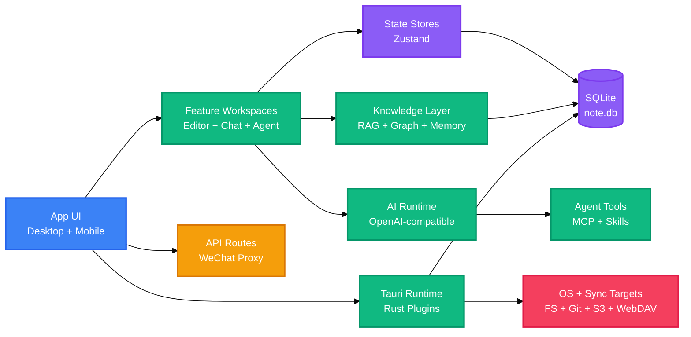

<!-- BEAUTIFIED -->

<p align="center">
  <a href="README.md">English</a> · 中文
</p>

<h1 align="center">LingMo</h1>
<p align="center">
  <strong>面向采集、写作、AI 协作与本地知识检索的跨平台 Markdown 工作台。</strong>
  <br />
  <em>Next.js · React · Tauri v2 · SQLite · RAG · MCP · Skills · 桌面端与移动端</em>
</p>

<p align="center">
  <a href="#快速开始"></a>
  <a href="LICENSE"></a>
</p>

<p align="center">
  
  
  
  
  
  
  
  
</p>

<p align="center">
  
  
</p>

## 功能特性

| 功能 | 说明 |
|---|---|
| 本地 Markdown 工作区 | 在 Tauri 桌面外壳中管理文件笔记、附件、图表、PDF、标签、收藏与编辑器标签页。 |
| AI 写作与对话 | 提供 OpenAI 兼容的对话、补全、翻译、改写、语音润色、视觉桥接、提示词增强与供应商模板。 |
| Agent 与工具运行时 | 通过本地工具、MCP Server、Skills、记忆、任务规划、审批、重试和运行快照驱动 Agent 操作。 |
| 知识检索 | 将笔记、图表、结构化知识、主题、关系、记忆和知识对象纳入基于 SQLite 的本地查询流程。 |
| 采集与输出工坊 | 支持文本、链接、图片、截图、识别结果、录音和待办采集，并导出文章、演示、报告、卡片和图表。 |
| 同步与发布路径 | 支持 GitHub、Gitee、GitLab、Gitea、S3 兼容存储、WebDAV、桌面打包、更新元数据和 Android 产物。 |

LingMo 基于开源项目 [NoteGen](https://github.com/codexu/note-gen) 构建。本仓库在原有基础上加入 LingMo 品牌、Tauri v2 发布基础设施、本地 AI 请求处理、面向 RAG 的知识模块、MCP 集成、Skills 与独立文档站。

## 快速开始

### 前置条件

```bash
node --version
pnpm --version
cargo --version
```

桌面端开发还需要安装目标操作系统对应的 Tauri v2 系统依赖。

### 安装依赖

```bash
pnpm install
```

### 启动桌面开发环境

```bash
pnpm tauri dev
```

### 构建

```bash
pnpm build
pnpm tauri build
```

## 使用方法

### 启动 Next.js 浏览器壳

```bash
pnpm dev
```

浏览器壳适合 UI 开发。原生文件访问、SQLite、快捷键、通知、更新器和平台集成需要在 Tauri 运行时中验证。

### 启动桌面开发包装器

```bash
pnpm dev:launch
```

`scripts/start-lingmo-dev.mjs` 会启动或复用 Next.js 开发服务器，预热关键路由，并在已有 debug Tauri 可执行文件时直接拉起桌面应用。

### 运行项目检查

```bash
pnpm check
pnpm test:agent
pnpm test:structured-knowledge
pnpm test:output-workshop
```

其他定向脚本覆盖 GitHub stars、AI 热点、网页提取、Draw.io XML、Draw.io 工具暴露和 research evaluation。

### 开发文档站

```bash
pnpm docs:dev
pnpm docs:build
pnpm docs:typecheck
```

文档站是 `docs/` 下的独立包，并在 `pnpm-workspace.yaml` 中纳入 workspace。

## 架构

LingMo 是一个有状态桌面应用。Next.js/React UI 负责工作区交互，Tauri/Rust 层提供原生能力，SQLite 在本地存储应用、知识、Agent 和同步数据。



## 配置

### 环境变量

仓库中存在本地 `.env` 和 `.env.local` 文件。请保留真实值在本地，README 只列出检测到的键名与用途。

| 变量 | 说明 | 默认值 |
|---|---|---|
| `TAURI_DEV_HOST` | 在 `next.config.ts` 中为 Next.js 开发服务器添加允许的开发来源。 | `127.0.0.1`, `localhost` |
| `NEXT_DEV_PORT` | `scripts/next-dev.mjs` 与 `scripts/start-lingmo-dev.mjs` 使用的端口。 | `3457` |
| `NEXT_DEV_HOST` | `scripts/next-dev.mjs` 使用的主机。 | `0.0.0.0` |
| `NEXT_DEV_URL` | `scripts/start-lingmo-dev.mjs` 轮询并预热的开发地址。 | `http://127.0.0.1:3457` |
| `OPENROUTER_API_KEY` | 配置后用于 OpenRouter 兼容 AI 访问的本地密钥。 | - |
| `NEXT_PUBLIC_UPGRADE_API_URL` | 事件上报使用的公开 UpgradeLink 端点。 | `https://api.upgrade.toolsetlink.com` |
| `NEXT_PUBLIC_UPGRADE_ACCESS_KEY` | 事件上报使用的公开 UpgradeLink access key。 | - |
| `NEXT_PUBLIC_UPGRADE_APP_KEY` | 事件上报使用的公开 UpgradeLink app key。 | - |
| `UPGRADE_SECRET_KEY` | 事件上报使用的服务端 UpgradeLink 签名密钥。 | - |

### 运行时配置

| 文件 | 用途 |
|---|---|
| `next.config.ts` | 在生产环境启用静态导出，配置图片处理、开发来源、服务端 Tauri alias、包导入优化，以及浏览器构建中的 Node-only 模块忽略。 |
| `src-tauri/tauri.conf.json` | 定义 LingMo 产品元数据、打包目标、图标、更新器公钥、更新端点和 Tauri 前端构建钩子。 |
| `pnpm-workspace.yaml` | 声明根应用和 `docs` 包，并配置 pnpm build allowance 与 React 19 peer dependency 规则。 |
| `components.json` | 配置 `src/components/ui` 使用的本地 shadcn 风格组件体系。 |

### 本地存储

| 存储 | 来源 | 用途 |
|---|---|---|
| `note.db` | `src/db/index.ts` 与 `@tauri-apps/plugin-sql` | SQLite 数据库，用于 chats、notes、marks、vectors、memories、activities、usage records、flashcards、knowledge objects、structured knowledge 与 graph data。 |
| `store.json` | Tauri store plugin | 应用设置、AI provider 配置、同步 provider 选项和 provider templates 缓存。 |
| `sync_config.json` | `src/lib/sync/sync-manager.ts` | 自动同步、push/pull、冲突策略、队列和状态设置。 |

## API

### Next.js Route Handlers

| 方法 | 路径 | 说明 | 认证 |
|---|---|---|---|
| GET | `/api/wx-proxy?url=<encoded-url>` | 获取 `mp.weixin.qq.com` 的 HTTPS 页面，将允许的微信图片 URL 重写到本地图片代理，并应用严格的 Content Security Policy。 | 无；通过 host allow-list 校验 |
| GET | `/api/wx-img?url=<encoded-url>` | 获取 `mmbiz.qpic.cn` 与 `mmbiz.qlogo.cn` 的图片，只跟随允许域名内的重定向，并返回可缓存的图片响应。 | 无；通过 host allow-list 校验 |

两个 route 都运行在 Next.js Node.js runtime 中，并会拒绝不支持的协议、域名和过多重定向。

## 项目结构

```text
LingMo/
├── src/
│   ├── app/                    # Next.js routes for desktop, mobile, settings, and API handlers
│   ├── components/             # Shared UI, providers, title bar controls, sync, memories, and output workshop components
│   ├── config/                 # Shortcut, emitter, and sync exclusion configuration
│   ├── db/                     # SQLite initialization and table-specific data modules
│   ├── hooks/                  # UI, AI completion, sync, output, mobile, and shortcut hooks
│   ├── lib/                    # AI, agents, MCP, skills, sync, diagrams, knowledge, speech, web, and utilities
│   ├── stores/                 # Zustand stores for application state
│   └── types/                  # Shared TypeScript domain types
├── src-tauri/
│   ├── src/                    # Rust Tauri entry points, commands, plugins, MCP runtime, backup, and skills v2
│   ├── capabilities/           # Tauri capability definitions
│   ├── icons/                  # Desktop, iOS, Android, and Windows icon assets
│   └── tauri.conf.json         # Tauri v2 application and bundle configuration
├── docs/
│   ├── app/                    # Standalone documentation pages
│   ├── components/             # Documentation shell, cards, callouts, and brand components
│   └── package.json            # Documentation package scripts
├── messages/                   # i18n message catalogs for English, Chinese, Japanese, Portuguese, and Traditional Chinese
├── public/                     # Static images, markdown CSS, PDF worker, provider icons, app icons, and Draw.io resources
├── scripts/                    # Dev startup, version sync, security check, and targeted test scripts
├── skills/                     # Bundled local skills used by the application
├── package.json                # Root scripts and frontend dependencies
└── pnpm-workspace.yaml         # Workspace package list and pnpm settings
```

## 技术栈

### 应用层

| 技术 | 用途 |
|---|---|
| Next.js 15 | App Router、API route handlers、Tauri 前端静态导出和 docs 包。 |
| React 19 | 桌面端、移动端、设置页和文档站的 UI 组件模型。 |
| TypeScript | 应用和文档 workspace 的类型校验。 |
| Tailwind CSS 4 | 应用和文档站的样式基础设施。 |
| Radix UI | 通过本地组件封装使用的可访问 UI primitives。 |
| Tiptap 3 | 富 Markdown 编辑、文本格式、表格、任务列表、数学公式和内容扩展。 |

### 原生与数据

| 技术 | 用途 |
|---|---|
| Tauri v2 | 桌面运行时、打包、更新器集成、原生 invoke handler 和移动端构建支持。 |
| Rust 2024 | MCP、AI 请求代理、备份导入导出、通知、设备、skills 和平台集成的原生命令。 |
| SQLite | 通过 `@tauri-apps/plugin-sql` 与 `rusqlite` 进行本地数据持久化。 |
| Zustand | 应用模块、设置、同步、对话、记忆和功能工作区的客户端状态容器。 |
| Tauri plugins | 文件系统、dialog、HTTP、store、SQL、shell、通知、全局快捷键、process、opener、updater 和 window state 集成。 |

### AI、知识与输出

| 技术 | 用途 |
|---|---|
| OpenAI SDK | OpenAI 兼容的 chat completions、模型列表、embeddings、streaming 和 provider validation。 |
| MCP | Runtime server 管理，以及面向 Agent 的动态工具暴露。 |
| Skills | 本地 `SKILL.md` 解析、匹配、校验、依赖处理和执行。 |
| ECharts / Mermaid / Draw.io | 知识图谱、可视化报告、图表和图示创作/导出路径。 |
| FFmpeg / Tesseract / PDF.js | 媒体处理、OCR、PDF 阅读和内容提取支持。 |
| `html2canvas`, `jsPDF`, `pptxgenjs`, `jszip` | 卡片、PDF、演示文稿、归档和生成物的导出流程。 |

### 构建、质量与发布

| 技术 | 用途 |
|---|---|
| pnpm | 根应用与 docs 包的 workspace 包管理。 |
| Cargo | Rust 依赖管理和原生构建流程。 |
| ESLint | 通过 `next lint` 进行源码 lint。 |
| TypeScript compiler | 通过 `tsc --noEmit` 执行静态检查。 |
| GitHub Actions | Android 产物、桌面 bundle、更新器元数据和 GitHub Release 的发布工作流。 |

## 部署

### 桌面端发布

```bash
pnpm sync-version
pnpm build
pnpm tauri build
```

`src-tauri/tauri.conf.json` 配置所有 bundle targets、图标、updater artifacts 和前端构建命令。发布环境提供 `TAURI_SIGNING_PRIVATE_KEY` 与 `TAURI_SIGNING_PRIVATE_KEY_PASSWORD` 时，Tauri signing 会使用这些变量。

### Android 发布

```bash
pnpm sync-version
pnpm tauri android init
pnpm tauri android build --apk --aab
```

`.github/workflows/release.yml` 会重新生成 Android 项目、恢复录音权限、应用自定义图标、构建 APK/AAB，在 Android keystore secrets 可用时签名，并用 `lingmo-v<version>` tag 格式上传 release 文件。

### 文档站

```bash
pnpm install
pnpm docs:build
```

文档站位于 `docs/`，是独立 Next.js package。静态托管时可将 `docs` 作为项目根目录，并使用 `out` 作为生成产物目录。

### Release Workflow

GitHub Actions workflow 会在 push 到 `release` 分支时运行。它构建 Android 产物、发布 Tauri 桌面 bundles、创建 `latest.json` 等 updater metadata，并向配置的 UpgradeLink endpoint 上报发布信息。

## 贡献

1. Fork 仓库。
2. 创建范围聚焦的功能分支。
3. 使用 `pnpm install` 安装依赖。
4. 运行 `pnpm check`，并执行与你改动区域相关的定向测试脚本。
5. 提交能说明改动原因的 commit message。
6. 向相关分支打开 pull request。

## 许可证

[GPL-3.0](LICENSE)
