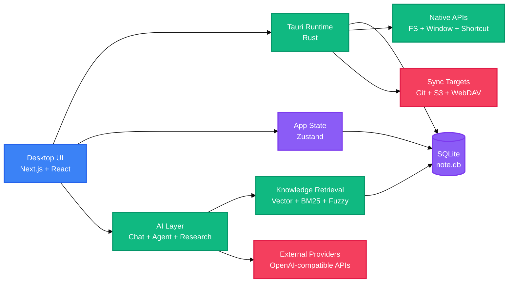

<!-- BEAUTIFIED -->

<p align="center">
  English · <a href="README-zh.md">中文</a>
</p>

<h1 align="center">LingMo</h1>
<p align="center">
  <strong>A cross-platform Markdown workspace for capture, writing, AI collaboration, and local knowledge retrieval.</strong>
  <br />
  <em>Next.js · React · Tauri v2 · SQLite · RAG · MCP · Skills</em>
</p>

<p align="center">
  <a href="#quick-start"></a>
  <a href="LICENSE"></a>
</p>

<p align="center">
  
  
  
  
  
  
  
</p>

## Features

| Feature | Description |
|---|---|
| Markdown workspace | Manages local Markdown notes, attachments, diagrams, PDFs, and writing assets from a Tauri desktop shell. |
| AI collaboration | Provides Chat, Agent, and Deep Research modes through OpenAI-compatible providers and local tool orchestration. |
| Knowledge retrieval | Builds a local RAG layer with vector search, BM25 scoring, fuzzy matching, and optional reranking. |
| Capture inbox | Collects text, smart links, screenshots, voice memos, local files, and quick todos before later organization. |
| Sync and backup | Supports GitHub, Gitee, GitLab, Gitea, S3-compatible storage, and WebDAV synchronization paths. |
| Extensible tools | Includes MCP integration, local Skills execution, diagram tools, output workshop flows, and agent harness modules. |

LingMo is based on the open-source [NoteGen](https://github.com/codexu/note-gen) project. This repository customizes the original foundation with LingMo branding, release links, RAG improvements, AI request handling, and additional project documentation.

## Quick Start

### Prerequisites

```bash
node --version
pnpm --version
cargo --version
```

Desktop development also requires the system dependencies for Tauri v2 on your operating system.

### Install

```bash
pnpm install
```

### Run Desktop Development

```bash
pnpm tauri dev
```

### Build

```bash
pnpm build
pnpm tauri build
```

## Usage

### Start the Browser Preview

```bash
pnpm dev
```

The browser preview is useful for UI work, but full local file, SQLite, shortcut, updater, and desktop integration paths require the Tauri runtime.

### Run Project Checks

```bash
pnpm check
```

### Build the Documentation Site

```bash
pnpm docs:build
```

### Build a Windows Installer

```bash
pnpm sync-version
pnpm tauri build --bundles nsis
```

## Architecture

LingMo is a stateful desktop application with a Next.js UI, a Tauri/Rust native layer, local SQLite storage, and optional external AI and sync services.



## Configuration

### Environment Variables

| Variable | Description | Default |
|---|---|---|
| `TAURI_DEV_HOST` | Adds an allowed development origin for the Next.js dev server in `next.config.ts`. | `127.0.0.1`, `localhost` |
| `NEXT_DEV_PORT` | Port used by `scripts/next-dev.mjs`. | `3457` |
| `NEXT_DEV_HOST` | Host used by `scripts/next-dev.mjs`. | `0.0.0.0` |
| `OPENROUTER_API_KEY` | Local API key used for OpenRouter-compatible AI access when configured. | — |
| `NEXT_PUBLIC_UPGRADE_API_URL` | Public UpgradeLink API endpoint used by event reporting. | `https://api.upgrade.toolsetlink.com` |
| `NEXT_PUBLIC_UPGRADE_ACCESS_KEY` | Public UpgradeLink access key used by event reporting. | — |
| `NEXT_PUBLIC_UPGRADE_APP_KEY` | Public UpgradeLink application key used by event reporting. | — |
| `UPGRADE_SECRET_KEY` | Server-side UpgradeLink signing secret used by event reporting. | — |

### Tauri Updater

| File | Purpose |
|---|---|
| `src-tauri/tauri.conf.json` | Defines product metadata, bundle targets, icons, updater endpoints, and the updater public key. |
| `.github/workflows/release.yml` | Builds desktop and Android release artifacts from the `release` branch. |

Updater signing requires `TAURI_SIGNING_PRIVATE_KEY` and, when configured, `TAURI_SIGNING_PRIVATE_KEY_PASSWORD` in the release environment.

## Project Structure

```text
LingMo/
├── src/
│   ├── app/               # Next.js app routes for desktop and mobile surfaces
│   ├── components/        # Shared UI components and feature panels
│   ├── db/                # SQLite table initialization and data access modules
│   ├── lib/               # AI, RAG, sync, MCP, Skills, diagrams, speech, and utilities
│   └── stores/            # Zustand stores for application state
├── src-tauri/
│   ├── src/               # Rust entry points and native Tauri integration
│   ├── icons/             # Desktop and mobile app icons
│   └── tauri.conf.json    # Tauri v2 application configuration
├── docs/
│   ├── app/               # Standalone documentation site pages
│   ├── components/        # Documentation site components
│   └── package.json       # Documentation package scripts and dependencies
├── messages/              # Internationalized UI message catalogs
├── public/                # Static assets and bundled Draw.io resources
├── scripts/               # Development, version sync, and test helper scripts
├── skills/                # Local application skills bundled with the project
├── package.json           # Workspace scripts and frontend dependencies
└── pnpm-workspace.yaml    # pnpm workspace definition for app and docs
```

## Tech Stack

### Application

| Technology | Purpose |
|---|---|
| Next.js 15 | App shell, static export, and documentation site framework. |
| React 19 | UI component model for desktop, mobile, and documentation surfaces. |
| TypeScript | Type checking across the application and documentation workspace. |
| Tailwind CSS | Styling system for the app and docs packages. |
| Tauri v2 | Native desktop runtime, bundling, updater, and OS integration. |
| Rust | Native database, file, sync, window, and platform support through Tauri plugins. |

### Data And AI

| Technology | Purpose |
|---|---|
| SQLite | Local database through `@tauri-apps/plugin-sql` and `rusqlite`. |
| Zustand | Client-side state management. |
| Tiptap | Rich Markdown editing foundation. |
| OpenAI SDK | OpenAI-compatible chat, completion, embedding, and model provider flows. |
| ECharts / Mermaid / Draw.io | Visual reporting, charting, and diagram authoring paths. |
| MCP / Skills | External tool invocation and local skill execution for agents. |

### Build And Quality

| Technology | Purpose |
|---|---|
| pnpm | Workspace package management. |
| Cargo | Rust dependency and native build management. |
| ESLint | Source linting through `next lint`. |
| TypeScript compiler | Static type validation with `tsc --noEmit`. |
| GitHub Actions | Release publishing from `.github/workflows/release.yml`. |

## Deployment

### Desktop Release

```bash
pnpm sync-version
pnpm tauri build
```

The release workflow is triggered by pushes to the `release` branch. It publishes Tauri desktop bundles and uses `lingmo-v__VERSION__` as the release tag format.

### Documentation Site

```bash
pnpm install
pnpm docs:build
```

The documentation site lives in `docs/` as an independent Next.js project. For Vercel, set the root directory to `docs`, the build command to `pnpm build`, and the output directory to `out`.

## Contributing

1. Fork the repository.
2. Create a feature branch with a focused scope.
3. Run `pnpm check` before submitting changes.
4. Commit the change with a clear message that explains why it exists.
5. Open a pull request against the relevant branch.

## License

[GPL-3.0](LICENSE)
