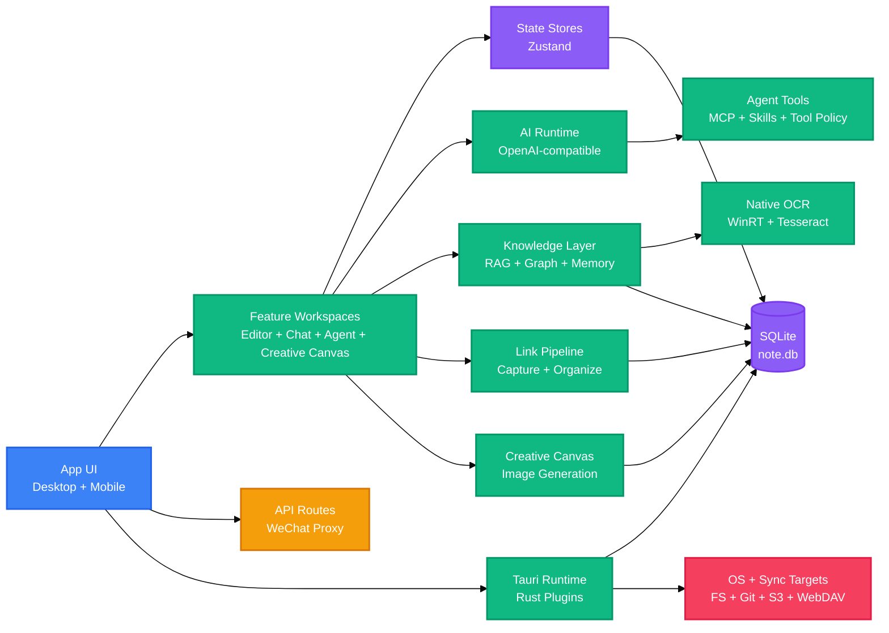

<!-- BEAUTIFIED -->

<p align="center">
  English · <a href="README-zh.md">中文</a>
</p>

<h1 align="center">LingMo</h1>
<p align="center">
  <strong>A cross-platform Markdown workbench for capture, writing, AI collaboration, and local knowledge retrieval.</strong>
  <br />
  <em>Next.js · React · Tauri v2 · SQLite · RAG · MCP · Skills · Desktop and Mobile</em>
</p>

<p align="center">
  <a href="#quick-start"></a>
  <a href="LICENSE"></a>
</p>

<p align="center">
  
  
  
  
  
  
  
  
</p>

<p align="center">
  
  
</p>

## Features

| Feature | Description |
|---|---|
| Local Markdown workspace | Manages file-based notes, attachments, diagrams, PDFs, tags, favorites, and editor tabs inside a Tauri desktop shell. |
| AI writing and chat | Provides OpenAI-compatible chat, completion, translation, rewriting, dictation polishing, vision bridge, prompt enhancement, conversation-continuity detection, and provider templates. |
| Creative canvas | A node-based infinite canvas for AI image-generation workflows: lay out prompt, config, and image nodes, connect them into pipelines, run them against any OpenAI-compatible image model, and reuse the generated assets in notes. |
| Agent and tool runtime | Routes agent actions through local tools, MCP servers, skills, memories, task planning, intent-aware tool policy, read-only batch execution, loop guards, and conversation memory ranking. |
| Knowledge retrieval and workflows | Indexes notes, diagrams, structured knowledge, topics, relations, memories, and knowledge objects into local SQLite-backed query flows, plus agent tools for batch tagging, frontmatter normalization, and incremental reindexing. |
| Link capture pipeline | A durable, crash-safe job pipeline that captures a URL into a mark, routes it by source type, and optionally rewrites it into a structured Markdown summary card with conflict-aware AI organize. |
| Native OCR and WeChat capture | Configurable OCR with native Windows (WinRT) provider plus Tesseract fallback, and a hardened WeChat article/image fetcher with multi-attempt scraping and strict redirect allow-lists. |
| Capture and output workshop | Captures text, links, images, screenshots, recognition results, recordings, todos, and exports polished articles, decks, reports, cards, and diagrams. |
| Sync and release paths | Supports GitHub, Gitee, GitLab, Gitea, S3-compatible storage, WebDAV, desktop bundling, updater metadata, and Android artifacts. |

LingMo is based on the open-source [NoteGen](https://github.com/codexu/note-gen) project. This repository adapts that foundation with LingMo branding, Tauri v2 release infrastructure, local AI request handling, RAG-oriented knowledge modules, MCP integration, skills, and a dedicated documentation site.

## Quick Start

### Prerequisites

```bash
node --version
pnpm --version
cargo --version
```

Desktop development also requires the system dependencies for Tauri v2 on the target operating system.

### Install

```bash
pnpm install
```

### Run Desktop Development

```bash
pnpm tauri dev
```

### Build

```bash
pnpm build
pnpm tauri build
```

## Usage

### Start the Next.js Browser Shell

```bash
pnpm dev
```

The browser shell is useful for UI work. Native file access, SQLite, shortcuts, notifications, updater behavior, and platform integrations require the Tauri runtime.

### Launch the Desktop Dev Wrapper

```bash
pnpm dev:launch
```

`scripts/start-lingmo-dev.mjs` starts or reuses the Next.js dev server, warms key routes, and launches the debug Tauri executable when it already exists.

### Run Project Checks

```bash
pnpm check                       # typecheck + lint
pnpm test:agent                  # agent runtime core
pnpm test:structured-knowledge   # structured-knowledge extraction & queue
pnpm test:output-workshop        # output export flows
pnpm test:creative-canvas        # creative-canvas generation & DB
pnpm test:db-runtime             # link-pipeline & DB runtime
pnpm test:wechat-ocr             # WeChat capture & OCR regression
```

Additional targeted scripts cover GitHub stars, AI hotspots, web extraction, Draw.io XML, Draw.io tool exposure, and research evaluation. Run a single suite with `pnpm test:<name>`, or everything in one pass:

```bash
pnpm test:agent && pnpm test:creative-canvas && pnpm test:db-runtime && pnpm test:wechat-ocr && pnpm test:structured-knowledge
```

### Work on the Documentation Site

```bash
pnpm docs:dev
pnpm docs:build
pnpm docs:typecheck
```

The documentation site is a separate package under `docs/` and is included in `pnpm-workspace.yaml`.

## Architecture

LingMo is a stateful desktop application. The Next.js/React UI handles workspace interaction, the Tauri/Rust layer provides native capabilities, and SQLite stores application, knowledge, agent, and sync data locally.



## Feature Highlights

### Creative Canvas

A node-based infinite canvas for designing and running AI image-generation workflows. Lay out **text prompt**, **config**, and **image** nodes on a freely pannable/zoomable canvas, connect them into generation pipelines (prompt → config → generated image, with reference images feeding image-edit flows), and execute against any OpenAI-compatible image model configured in the app.

- **Node graph**: directional edges let a config node pull its prompt from upstream text nodes and reference images from upstream image nodes, supporting both generation and edit flows.
- **Generation jobs**: tracked with statuses (queued / running / succeeded / failed / cancelled / stale), including stale-job recovery on restart and retry of failed jobs.
- **Asset library**: thumbnails generated lazily, drag-and-drop import, add-to-canvas, insert-into-note, and a cleanup tool that finds unused assets and reclaims disk space.
- **Snapshot exchange**: export the full canvas graph as JSON and import `basketikun/infinite-canvas`-style JSON into a new project.
- **Agent-driven**: ~25 `creative_canvas_*` / `canvas_*` tools (also published as MCP schemas) let the in-app agent or external MCP clients build flows, run generation, and insert assets without opening the UI. Entry point: the Creative Canvas tab, the sidebar panel, or the `open-creative-canvas` event from chat.

Persistence spans five SQLite tables (`creative_canvas_projects`, `creative_canvas_nodes`, `creative_canvas_edges`, `creative_canvas_assets`, `creative_generation_jobs`) with schema versioning. Generated images are stored under `AppData/creative-canvas/assets`.

### Link Capture Pipeline

When you save a link, instead of fetching and organizing inline, the request is enqueued as a **durable job** that captures the page into a mark, routes it by source type, and (optionally) rewrites it into a structured Markdown summary card via an AI organize pass. Jobs are crash-safe: leases, checkpoints, retries, and an auto-recovery scan mean a half-finished capture or organize step resumes after a restart, and the original text is never lost if the AI step fails.

The pipeline lives in `src/lib/link-pipeline/` and persists state through `src/db/link-pipeline.ts`. Stages run as `capture → extract → organize → render → complete`:

| Layer | Responsibility |
|---|---|
| `source-router` | Classifies the URL into `webpage \| github \| wechat \| xiaohongshu \| video \| unknown` and decides the organization strategy (`generic_ai`, `adapter_structured`, or `capture_only`). |
| `capture-adapters` / `capture-runner` | One adapter per source type fetches and extracts content; webpages use Tauri HTTP + charset detection with a Tavily Extract fallback for hostile/dynamic pages. The runner claims the job under a lease, persists a `link` mark, and enqueues organize if needed. |
| `organize-runner` | Calls the AI to produce title / summary / key points / cleaned body. If the source fingerprint matches an existing output version, the previous result is reused instead of re-calling the model. |
| `chunker` | Splits long bodies on natural breaks with overlap and balanced sampling so long articles get concurrent per-chunk extraction then a merge pass. |
| `projection` | FNV-1a-32 fingerprint of `desc\0content` — used both as the AI-output reuse key and as the conflict-detection baseline. |

AI writes use optimistic compare-and-swap keyed on the baseline projection: if you edited the mark while the AI was working, the job still completes but the output is flagged as a conflict rather than overwriting your edit. A small **Link Job Status** badge renders per link mark (spinner / "AI 已整理" / retry button / amber "结果待应用" conflict state), updated live via emitter events.

### Agent Runtime

A streamlined single harness runner (`src/lib/agent-harness/harness-agent-runner.ts`) owns the loop, batching, loop-guarding, and final-answer synthesis. Recent work removed three speculative modules (`enhanced-resume`, `parallel-tool-executor`, `tool-result-budget`) and folded their useful logic inline, and added:

- **Intent-aware tool policy** — write / file-creation / destructive / execute tools are blocked unless the user's intent matches, so the model can't silently create or delete files it wasn't asked to.
- **Read-only batch execution** — all-read-only tool steps run concurrently under a bounded limit; writes are forced single-step.
- **Loop guards** — repeated identical tool calls and consecutive failures are stopped automatically, and the ReAct iteration budget adapts to lookup density.
- **Conversation continuity** (`src/lib/ai/conversation-continuity.ts`) — classifies each user turn as selection / continuation / reference / short-reply / standalone (parsing numbered, lettered, and Chinese 第几个 / 前者后者 selections), rewrites the retrieval query, and tunes history budgets.
- **Memory relevance scoring** (`src/lib/context/memory-relevance.ts`) — CJK-bigram + ASCII-word lexical scoring blended with optional semantic similarity, used to rank long-term memories before injection.
- **Knowledge workflow tools** — batch `tag_files`, `set_note_status`, `bulk_ensure_frontmatter`, plus read-only triage (`find_unindexed_notes`, `get_knowledge_system_health`) and incremental `reindex_knowledge_objects`, all routed through the authoritative frontmatter parser.

### Native OCR and WeChat Capture

- **Configurable OCR** — `ocr(path)` now tries the **native system OCR first** (the Windows WinRT `OcrEngine`, provider `ocr-native-windows`) and falls back to **Tesseract** on empty result or error. The Tesseract language-pack list (`tesseractList` in settings) drives both engines; Chinese locales get a Chinese-first default ordering. The settings panel shows the detected native provider with a Ready / Unavailable badge.
- **Hardened WeChat fetching** (`src-tauri/src/wechat_mp.rs`) — article fetching retries with up to three UA/cookie header sets, detects verification / captcha pages as soft failures, enforces a strict redirect allow-list (articles must stay on `mp.weixin.qq.com`; images on `mmbiz.qpic.cn` / `mmbiz.qlogo.cn`), caps image bytes at 8 MiB, and bounds timeouts to a 45 s UI budget. Session state is held in memory with a 7-day TTL.

## Configuration

### Environment Variables

The repository contains local `.env` and `.env.local` files. Keep real values private; the table lists only detected keys and behavior.

| Variable | Description | Default |
|---|---|---|
| `TAURI_DEV_HOST` | Adds an allowed development origin for the Next.js dev server in `next.config.ts`. | `127.0.0.1`, `localhost` |
| `NEXT_DEV_PORT` | Port used by `scripts/next-dev.mjs` and `scripts/start-lingmo-dev.mjs`. | `3457` |
| `NEXT_DEV_HOST` | Host used by `scripts/next-dev.mjs`. | `0.0.0.0` |
| `NEXT_DEV_URL` | URL polled and warmed by `scripts/start-lingmo-dev.mjs`. | `http://127.0.0.1:3457` |
| `OPENROUTER_API_KEY` | Local key for OpenRouter-compatible AI access when configured. | - |
| `NEXT_PUBLIC_UPGRADE_API_URL` | Public UpgradeLink endpoint used by event reporting. | `https://api.upgrade.toolsetlink.com` |
| `NEXT_PUBLIC_UPGRADE_ACCESS_KEY` | Public UpgradeLink access key used by event reporting. | - |
| `NEXT_PUBLIC_UPGRADE_APP_KEY` | Public UpgradeLink application key used by event reporting. | - |
| `UPGRADE_SECRET_KEY` | Server-side UpgradeLink signing secret used by event reporting. | - |

### Runtime Configuration

| File | Purpose |
|---|---|
| `next.config.ts` | Enables static export in production, configures image handling, allowed development origins, server-side Tauri aliases, package import optimization, and browser build ignores for Node-only modules. |
| `src-tauri/tauri.conf.json` | Defines the LingMo product metadata, bundle targets, icons, updater public key, updater endpoints, and Tauri frontend build hooks. |
| `pnpm-workspace.yaml` | Declares the root app and `docs` package, plus pnpm build allowances and React 19 peer dependency rules. |
| `components.json` | Configures the local shadcn-style component setup used by `src/components/ui`. |

### Local Stores

| Store | Source | Purpose |
|---|---|---|
| `note.db` | `src/db/index.ts` and `@tauri-apps/plugin-sql` | SQLite database for chats, notes, marks, vectors, memories, activities, usage records, flashcards, knowledge objects, structured knowledge, graph data, creative-canvas projects/nodes/edges/assets/jobs, and link-pipeline jobs/stage results/source blocks/output versions. |
| `store.json` | Tauri store plugin | Application settings, AI provider configuration, sync provider options, and cached provider templates. |
| `sync_config.json` | `src/lib/sync/sync-manager.ts` | Auto-sync, push/pull, conflict policy, queue, and status settings. |

## API

### Next.js Route Handlers

| Method | Path | Description | Auth |
|---|---|---|---|
| GET | `/api/wx-proxy?url=<encoded-url>` | Fetches HTTPS pages from `mp.weixin.qq.com`, rewrites allowed WeChat image URLs through the local image proxy, and applies a restrictive content security policy. | None; host allow-list validation |
| GET | `/api/wx-img?url=<encoded-url>` | Fetches images from `mmbiz.qpic.cn` and `mmbiz.qlogo.cn`, follows only allowed redirects, and returns cacheable image responses. | None; host allow-list validation |

Both routes run on the Next.js Node.js runtime and reject unsupported protocols, hosts, and excessive redirects.

## Project Structure

```text
LingMo/
├── src/
│   ├── app/                    # Next.js routes for desktop, mobile, settings, and API handlers
│   │   └── core/main/creative-canvas/  # Creative canvas workspace, sidebar panel, model select, constants
│   ├── components/             # Shared UI, providers, title bar controls, sync, memories, output workshop, creative-canvas modal
│   ├── config/                 # Shortcut, emitter, and sync exclusion configuration
│   ├── db/                     # SQLite initialization and table-specific modules (incl. creative-canvas, link-pipeline)
│   ├── hooks/                  # UI, AI completion, sync, output, mobile, and shortcut hooks
│   ├── lib/
│   │   ├── ai/                 # Provider runtime, history messages, conversation-continuity, link-organizer
│   │   ├── agent/              # Agent handler, tool policy, dynamic tool filter, prompt assembler, tools/*
│   │   ├── agent-harness/      # Single harness runner, tool governance/runtime, turn lifecycle, conversation messages
│   │   ├── creative-canvas/    # Generation pipeline, importer, geometry, assets, cleanup
│   │   ├── knowledge-query/    # Query engine and types over the local knowledge graph
│   │   ├── link-pipeline/      # source-router, capture-adapters/runner, organize-runner, chunker, projection
│   │   ├── context/            # Context loader and memory-relevance scoring
│   │   └── ...                 # MCP, skills, sync, diagrams, speech, web, utilities
│   ├── stores/                 # Zustand stores for application state (incl. creative-canvas)
│   └── types/                  # Shared TypeScript domain types (incl. creative-canvas)
├── src-tauri/
│   ├── src/                    # Rust entry points, commands, plugins, MCP runtime, backup, skills v2, ocr_packages, wechat_mp
│   ├── capabilities/           # Tauri capability definitions
│   ├── icons/                  # Desktop, iOS, Android, and Windows icon assets
│   └── tauri.conf.json         # Tauri v2 application and bundle configuration
├── docs/
│   ├── app/                    # Standalone documentation pages
│   ├── components/             # Documentation shell, cards, callouts, and brand components
│   └── package.json            # Documentation package scripts
├── messages/                   # i18n message catalogs for English, Chinese, Japanese, Portuguese, and Traditional Chinese
├── public/                     # Static images, markdown CSS, PDF worker, provider icons, app icons, and Draw.io resources
├── scripts/                    # Dev startup, version sync, security check, and targeted test scripts
├── skills/                     # Bundled local skills used by the application
├── package.json                # Root scripts and frontend dependencies
└── pnpm-workspace.yaml         # Workspace package list and pnpm settings
```

## Tech Stack

### Application

| Technology | Purpose |
|---|---|
| Next.js 15 | App Router, API route handlers, static export for the Tauri frontend, and the docs package. |
| React 19 | UI component model for desktop, mobile, settings, and documentation surfaces. |
| TypeScript | Type validation across the app and docs workspace. |
| Tailwind CSS 4 | Styling infrastructure for the app and documentation site. |
| Radix UI | Accessible UI primitives used through local components. |
| Tiptap 3 | Rich Markdown editing, text formatting, tables, task lists, math, and content extensions. |

### Native And Data

| Technology | Purpose |
|---|---|
| Tauri v2 | Desktop runtime, bundling, updater integration, native invoke handlers, and mobile build support. |
| Rust 2024 | Native commands for MCP, AI request proxying, backup import/export, notifications, devices, skills, and platform integration. |
| SQLite | Local data persistence through `@tauri-apps/plugin-sql` and `rusqlite`. |
| Zustand | Client-side state containers for app modules, settings, sync, chat, memories, and feature workspaces. |
| Tauri plugins | File system, dialog, HTTP, store, SQL, shell, notifications, global shortcuts, process, opener, updater, and window state integration. |

### AI, Knowledge, And Output

| Technology | Purpose |
|---|---|
| OpenAI SDK | OpenAI-compatible chat completions, model listing, embeddings, streaming, image generation/edits, and provider validation. |
| MCP | Runtime server management and dynamic tool exposure for agents. |
| Skills | Local `SKILL.md` parsing, matching, validation, dependency handling, and execution. |
| ECharts / Mermaid / Draw.io | Knowledge graphs, visual reports, charting, and diagram authoring/export paths. |
| WinRT OcrEngine / Tesseract / PDF.js | Native Windows OCR with Tesseract fallback, PDF reading, and content extraction support. |
| `html2canvas`, `jsPDF`, `pptxgenjs`, `jszip` | Export flows for cards, PDFs, presentations, archives, and generated artifacts. |

### Build, Quality, And Release

| Technology | Purpose |
|---|---|
| pnpm | Workspace package management for the root app and docs package. |
| Cargo | Rust dependency management and native build pipeline. |
| ESLint | Source linting through `next lint`. |
| TypeScript compiler | Static checks through `tsc --noEmit`. |
| GitHub Actions | Release workflow for Android artifacts, desktop bundles, updater metadata, and GitHub releases. |

## Deployment

### Desktop Release

```bash
pnpm sync-version
pnpm build
pnpm tauri build
```

`src-tauri/tauri.conf.json` configures all bundle targets, icons, updater artifacts, and the frontend build command. Tauri signing uses `TAURI_SIGNING_PRIVATE_KEY` and `TAURI_SIGNING_PRIVATE_KEY_PASSWORD` when the release environment provides them.

### Android Release

```bash
pnpm sync-version
pnpm tauri android init
pnpm tauri android build --apk --aab
```

`.github/workflows/release.yml` recreates the generated Android project, restores recording permissions, applies custom icons, builds APK/AAB artifacts, signs them when Android keystore secrets are available, and uploads release files with the `lingmo-v<version>` tag format.

### Documentation Site

```bash
pnpm install
pnpm docs:build
```

The documentation site lives in `docs/` as an independent Next.js package. For static hosting, use `docs` as the project root and `out` as the generated output directory.

### Release Workflow

The GitHub Actions workflow runs on pushes to the `release` branch. It builds Android artifacts, publishes Tauri desktop bundles, creates updater metadata such as `latest.json`, and reports release information to the configured UpgradeLink endpoint.

## Contributing

1. Fork the repository.
2. Create a focused feature branch.
3. Install dependencies with `pnpm install`.
4. Run `pnpm check` and the targeted test script for the area you changed.
5. Commit with a message that explains why the change exists.
6. Open a pull request against the relevant branch.

## License

[GPL-3.0](LICENSE)
