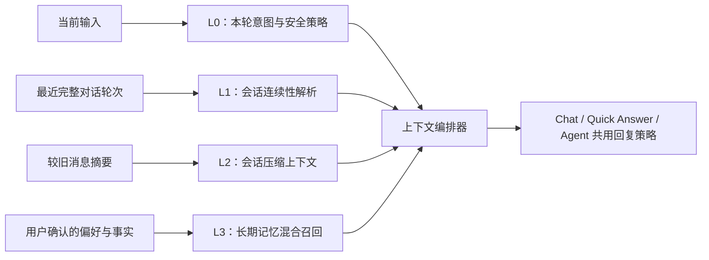

# Agent 多轮对话与记忆重构方案

## 目标

让 Agent 在第二轮及后续轮次中，能稳定理解“3”“继续”“按上面的方案做”“后者”等依赖前文的短回复，同时让用户看得见当前会话是否正在延续、历史占用了多少上下文，以及长期记忆何时会被使用。

本轮改造保持三个边界：

- 不把普通聊天自动写入长期记忆；长期记忆仍由用户明确要求或审核队列确认。
- 不用隐藏的“解析后指令”扩大写入、执行或删除权限；工具授权仍以用户原始输入和既有确认策略为准。
- 不替换现有聊天存储与 Agent Harness，只修复上下文编排边界并复用当前数据库、压缩和记忆设施。

## 根因

当前链路已经把最近若干轮原始消息发给模型，但缺少结构化的会话连续性层：

1. 路由器只读取当前输入，裸数字会被判定为独立的快速问答。
2. 快速回答提示词没有要求把数字、代词、肯定/否定和“继续”绑定到最近一条助手消息。
3. Agent Runner 会删除上游追加的 system context，导致会话解析、文档约束等可信上下文在快速路径丢失。
4. 长消息截断只保留开头，位于回答末尾的选项和未决问题可能被裁掉。
5. 长期记忆仅依赖向量召回；嵌入服务不可用时，保存和召回都退化为不可用。

## 四层上下文模型

- **L0 本轮状态**：原始用户输入、附件、引用、当前文档和工具权限。优先级最高，不被历史覆盖。
- **L1 会话连续性**：从最近助手消息中解析编号选项、字母选项、未决问题、继续/前者/后者等引用。它只解释指代，不改变用户可见消息。
- **L2 会话压缩**：最近轮次保留原文；旧助手消息使用摘要。长消息采用“头尾保留”，避免把结论、选项和最后的问题裁掉。
- **L3 长期记忆**：偏好始终按预算注入；事实记忆使用向量与词法混合召回。无嵌入模型时允许保存，并以词法匹配降级。

## 回复策略

- 上一条助手消息存在明确的第 3 项时，用户输入“3”应直接承接第 3 项，不再罗列“3 可能代表什么”。
- 只有在没有唯一指代目标时，才提出一个精确澄清问题。
- 快速回答仍保持零工具调用，但必须读取并服从最近对话历史。
- 需要工具的选项选择可以进入完整 Agent；是否允许写入、执行或删除仍由原始输入和确认策略决定。
- 同一条可信 system context 在 Runner 中只保留一次，并在多次 Agent 迭代中持续存在。

## 交互设计

- 输入区上下文环增加“会话延续”状态和最近轮次数，让用户知道短回复会承接前文。
- Tooltip 明确区分“当前输入、对话历史、长期记忆按需检索、剩余上下文”。
- 有历史时用低干扰状态点提示延续；新会话或清除上下文后状态立即消失。
- 不增加强提醒、弹窗或每轮确认，保持当前工作台的克制密度。

## 回归边界

- 有编号选项 + `3`：解析为第 3 项。
- 无编号选项 + `3`：不得猜测映射。
- `第3个`、`C`、`后者`、`继续`：在存在唯一前文目标时解析。
- 长回答的选项位于末尾：裁剪后仍保留。
- 可信附加 system context：合并后不丢失、不重复。
- 清除上下文、新会话、截断消息：不得串用旧会话状态。
- 嵌入服务不可用：长期记忆仍可保存，并可通过词法相关性召回。
- AI 完成回调：数据库保存完成后本轮执行才结束。

