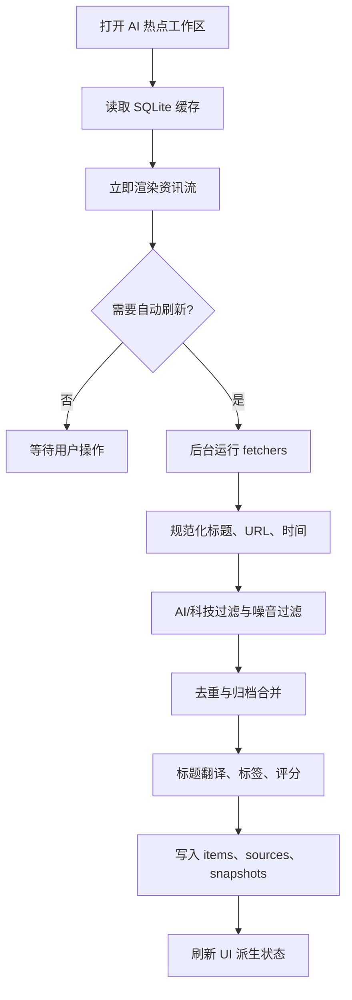

# LingMo AI 热点模块设计

## 背景

LingMo 是本地优先的 Markdown 笔记与 AI 知识整理应用。用户希望在当前项目中集成一个关注 AI 科技前沿的热点模块，用于实时追踪 AI 领域最新动态，并通过多源聚合和智能筛选快速发现有价值的资讯。

参考项目 `C:\Users\colin\Desktop\新建文件夹\ai-news-aggregator` 已实现一套独立的 AI 资讯聚合系统。它的核心思路是：多 fetcher 并发抓取，单源失败隔离，关键词过滤，标题去重，标题翻译缓存，24h/7d JSON 快照，以及 React 资讯流展示。LingMo 不应直接搬入它的独立 Web 页面，而应吸收其采集和处理模型，做成 LingMo 原生工作区。

## 目标

- 提供一个原生 `AI 热点` 工作区，让用户快速浏览 AI 前沿资讯。
- 打开模块时自动刷新，同时支持手动刷新。
- 首屏先展示本地缓存，后台刷新不阻塞阅读。
- 第一版内置稳定精选源，并支持用户通过 RSS/OPML 扩展。
- 支持收藏、已读、筛选、搜索和保存为 Markdown 笔记。
- 支持从当前资讯流或收藏生成 AI 日报/周报，并沉淀到 LingMo 工作区。
- 保持 LingMo 的内容优先、低干扰、安静可靠的产品风格。

## 非目标

- 第一版不抓取所有文章正文。
- 第一版不自动对所有新闻调用大模型。
- 第一版不做复杂推荐算法或个性化排序。
- 第一版不做账号级云同步。
- 第一版不做独立移动端体验，只保证现有响应式布局可用。
- 不复制 `ai-news-aggregator` 的独立站视觉风格。

## 参考项目实现摘要

`ai-news-aggregator` 的数据链路如下：

1. `src/fetchers` 中每个来源实现一个 fetcher，统一返回 `RawItem[]`。
2. `runFetcher` 对每个来源独立捕获异常，生成 `FetchStatus`。
3. `src/index.ts` 并发运行内置 fetcher，并额外读取 OPML RSS。
4. 抓取结果规范化为归档项，按 `archive-days` 保留历史。
5. 通过 `isAiRelated` 做 AI/科技相关性过滤。
6. 通过 `dedupeItemsByTitleUrl` 做标题和 URL 去重。
7. 通过标题翻译缓存补充 `title_zh`、`title_en`、`title_bilingual`。
8. 输出 `latest-24h.json`、`latest-7d.json`、`archive.json`、`source-status.json`。
9. Web 前端读取 JSON 快照，提供筛选、搜索、收藏、阅读历史和时间范围切换。

值得借鉴的设计：

- fetcher 策略模式，方便增加来源。
- 局部失败可见但不阻断整体刷新。
- 24h/7d 双窗口适合资讯场景。
- 关键词快筛可解释、低成本。
- 翻译缓存避免重复请求。
- 来源状态单独输出，便于排错。

需要改造的地方：

- JSON 快照应改为 LingMo SQLite 主存储。
- 独立 Vite 页面应改为 LingMo 原生 `lingmo://...` 工作区。
- 收藏、已读、笔记保存、聊天上下文和 RAG 应接入 LingMo 现有能力。
- 大模型能力应按需触发，而不是进入刷新主链路。

## 推荐方案

采用 LingMo 原生热点工作区。

新增虚拟路径 `lingmo://ai-hotspots`，左侧 rail 增加 `AI 热点` 图标入口。编辑区识别该路径后渲染 `AiHotspotsWorkspace`。模块内部复用 `ai-news-aggregator` 的采集、过滤和去重思路，但数据进入 LingMo 的 SQLite 与 Zustand 状态层。

第一版数据源采用“稳定精选源 + 可配置 RSS/OPML”的组合：

- 内置稳定源：AI 今日热榜、NewsNow、AIbase、AIHubToday、OPML RSS、YouTube 等。
- 用户源：支持添加 RSS、启用/禁用 RSS、导入 OPML。
- 后续扩展：微信公众号、WaytoAGI、更多平台 fetcher、来源市场。

## 模块分层

### 采集与处理层

目录建议为 `src/lib/ai-hotspots`。

职责：

- 定义统一 fetcher 接口。
- 实现默认来源 fetchers。
- 实现 RSS/OPML 解析。
- 实现 URL 规范化、标题清洗、时间解析。
- 实现 AI/科技关键词过滤、噪音过滤、去重。
- 实现标题翻译缓存。
- 实现标签规则和轻量重要性评分。
- 汇总每个来源的刷新状态。

核心类型：

```ts
interface AiHotspotRawItem {
  sourceId: string
  sourceName: string
  feedName: string
  title: string
  url: string
  publishedAt: Date | null
  meta: Record<string, unknown>
}

interface AiHotspotFetchStatus {
  sourceId: string
  sourceName: string
  ok: boolean
  itemCount: number
  durationMs: number
  error: string | null
}
```

### 数据层

目录建议为 `src/db/ai-hotspots.ts`。

使用 SQLite 作为主存储，原因是 LingMo 已经有成熟的 `getDb`、`serializedWrite` 和本地数据表模式。

建议表：

`ai_hotspot_items`

- `id`
- `source_id`
- `source_name`
- `feed_name`
- `title`
- `title_original`
- `title_en`
- `title_zh`
- `url`
- `published_at`
- `first_seen_at`
- `last_seen_at`
- `summary`
- `tags_json`
- `score`
- `is_favorite`
- `is_read`
- `saved_note_path`

`ai_hotspot_sources`

- `source_id`
- `source_name`
- `kind`
- `enabled`
- `last_ok_at`
- `last_error`
- `item_count`
- `duration_ms`
- `updated_at`

`ai_hotspot_user_feeds`

- `id`
- `title`
- `feed_url`
- `group_name`
- `enabled`
- `created_at`
- `updated_at`

`ai_hotspot_snapshots`

- `id`
- `started_at`
- `completed_at`
- `raw_count`
- `kept_count`
- `failed_count`
- `status_json`

### 状态层

目录建议为 `src/stores/ai-hotspots.ts`。

职责：

- 初始化数据库并加载缓存。
- 打开工作区时自动刷新。
- 手动刷新。
- 防止并发刷新。
- 维护筛选状态。
- 派生当前列表、来源统计、失败源数量。
- 收藏、已读、保存路径更新。
- 生成日报/周报。

建议状态：

```ts
type AiHotspotTimeRange = '24h' | '7d'
type AiHotspotView = 'latest' | 'favorites' | 'digest' | 'sources'

interface AiHotspotFilters {
  query: string
  timeRange: AiHotspotTimeRange
  sourceId: string
  status: 'all' | 'unread' | 'favorite' | 'saved'
}
```

### UI 层

目录建议为 `src/app/core/main/ai-hotspots`。

主要组件：

- `ai-hotspots-constants.ts`
- `ai-hotspots-workspace.tsx`
- `hotspot-filter-bar.tsx`
- `hotspot-list.tsx`
- `hotspot-item.tsx`
- `hotspot-source-view.tsx`
- `hotspot-digest-view.tsx`
- `hotspot-settings-dialog.tsx`

入口接入点：

- `src/app/core/main/left-sidebar.tsx` 增加 rail 按钮。
- `src/app/core/main/editor/editor-layout.tsx` 增加虚拟路径识别和动态导入。
- `src/db/index.ts` 的 `initAllDatabases` 增加 `initAiHotspotsDb`。

## 刷新策略

模块打开后：

1. 立即从 SQLite 读取缓存并展示。
2. 检查设置中的 `autoRefreshOnOpen`。
3. 如果开启，并且距离上次成功刷新超过冷却时间，后台刷新。
4. 刷新中保留当前列表可读可操作。
5. 手动刷新无视冷却时间，但仍受并发锁保护。

默认设置：

- `autoRefreshOnOpen`: `true`
- `refreshCooldownMinutes`: `30`
- `defaultTimeRange`: `24h`
- `translateTitles`: `true`
- `translateMaxNew`: `80`

失败策略：

- 单个来源失败不影响其他来源。
- 所有来源失败时继续显示缓存。
- UI 顶部只显示轻量状态，例如 `12 个来源成功，2 个失败`。
- 详细错误只在来源视图展开。

## 数据流



## 界面设计

整体保持 LingMo 的紧凑、安静风格，不做大面积装饰。

顶部栏：

- 左侧：图标和标题 `AI 热点`。
- 中间：视图切换 `最新`、`收藏`、`日报`、`来源`。
- 右侧：上次刷新时间、刷新按钮、设置按钮。

筛选区：

- 时间范围：`24h` / `7d`
- 来源：全部 / 默认源 / RSS / 单一来源
- 状态：全部 / 未读 / 收藏 / 已保存
- 搜索：标题、来源、标签

资讯列表项：

- 中文标题优先显示。
- 原文标题可在 hover 或展开区域查看。
- 来源、feed 名称、发布时间。
- 标签，例如 `模型发布`、`产品更新`、`论文研究`、`开源项目`、`融资产业`、`教程观点`。
- 操作：打开链接、收藏、标记已读、发送到聊天、保存为笔记、深挖。

日报视图：

- `生成 24h AI 日报`
- `生成 7d AI 周报`
- 范围：全部 / 收藏 / 未读 / 当前筛选结果
- 输出为 Markdown，保存到 `AI热点/YYYY-MM-DD-AI日报.md` 或相近目录。

来源视图：

- 展示默认源和用户 RSS/OPML 源。
- 支持启用、禁用、添加 RSS、导入 OPML。
- 显示每个来源的成功状态、条目数、耗时和最近错误。

## 筛选与智能处理

第一版采用规则优先，AI 增强按需触发。

规则过滤：

- AI 关键词：AIGC、LLM、GPT、Claude、Gemini、DeepSeek、OpenAI、Anthropic、Hugging Face、Transformer、Agent、多模态、大模型、智能体、算力、推理、微调等。
- 科技关键词：robot、robotics、vision、chip、GPU、CUDA、cloud、developer、开源、编程、芯片、机器人、具身等。
- 噪音关键词：娱乐、明星、体育、彩票、旅游、美食、电商促销等。
- 专业 AI 源可配置为默认保留。

去重：

- 优先使用规范化 URL。
- 辅助使用规范化标题。
- 同组取发布时间更新的项。

标签：

- `模型发布`
- `产品更新`
- `论文研究`
- `开源项目`
- `开发工具`
- `融资产业`
- `教程观点`

评分：

- 来源权重。
- 关键词权重。
- 多源重复出现加权。
- 发布时间新鲜度。

大模型能力：

- 不进入默认刷新链路。
- 单条 `深挖` 可调用 LingMo 现有 Deep Research / Tavily 能力。
- `发送到聊天` 将标题、来源、链接、标签和摘要作为上下文。
- `生成日报/周报` 使用当前筛选结果或收藏结果作为输入。

## 笔记沉淀

单条保存模板：

```md
# 标题

- 来源：
- 发布时间：
- 原文链接：
- 标签：

## 摘要

待生成或手动补充。

## 观察

-
```

日报模板：

```md
# AI 热点日报 YYYY-MM-DD

## 速览

- 今日重点 3-5 条

## 模型与产品

## 开源与开发者工具

## 研究与论文

## 产业与商业

## 值得继续跟进

## 来源

- [标题](url) - 来源
```

保存为 Markdown 后，复用 LingMo 现有文件保存、笔记索引和向量处理流程。热点模块只记录 `saved_note_path`，不新增独立 RAG 管线。

## 设置

第一版设置项：

- 打开模块时自动刷新。
- 自动刷新冷却时间。
- 默认时间范围。
- 标题翻译开关。
- 单次翻译上限。
- 默认源启用/禁用。
- RSS 添加、删除、启用/禁用。
- OPML 导入。

后续可扩展：

- 用户关键词白名单。
- 用户关键词黑名单。
- 来源权重编辑。
- 日报模板编辑。

## 测试策略

单元测试：

- URL 规范化。
- 标题归一化。
- 关键词过滤。
- 噪音过滤。
- 去重。
- 标签规则。
- 重要性评分。

数据层测试：

- 初始化表。
- upsert 资讯项。
- upsert 来源状态。
- 收藏、已读、保存路径更新。
- 用户 RSS CRUD。

Store 测试：

- 加载缓存。
- 自动刷新冷却判断。
- 手动刷新。
- 局部失败。
- 重复刷新保护。
- 筛选派生状态。

UI smoke：

- 打开 `AI 热点` 工作区。
- 触发刷新。
- 搜索和筛选。
- 收藏和标记已读。
- 保存为笔记。
- 查看来源失败详情。

回归重点：

- 不影响现有编辑器。
- 不影响 GitHub 管理。
- 不影响左侧 rail 和虚拟 tab。
- 不影响文件保存和向量索引。

## 风险与缓解

外部来源不稳定：

- 使用单源失败隔离和来源状态。
- 保留缓存可读。

抓取成本过高：

- 默认只启用稳定精选源。
- RSS 并发限制。
- 自动刷新冷却。

大模型成本不可控：

- 默认刷新不调用大模型。
- 只在用户点击深挖或生成日报时调用。

数据量增长：

- 保留最近 N 天归档。
- 对 `published_at`、`last_seen_at`、`source_id` 建索引。

UI 复杂度膨胀：

- 第一版只保留 `最新`、`收藏`、`日报`、`来源` 四个视图。
- 设置先做基础 RSS/OPML 和刷新选项。

## 第一版验收标准

- 左侧 rail 能打开 `AI 热点` 工作区。
- 打开后先显示缓存，再按冷却策略自动刷新。
- 手动刷新可用，刷新失败不清空缓存。
- 至少 4 个稳定默认源可抓取并入库。
- RSS 添加和 OPML 导入可用。
- 24h/7d 切换、来源筛选、状态筛选、搜索可用。
- 收藏、已读、保存为笔记可用。
- 可从当前筛选结果或收藏生成 Markdown 日报。
- 来源视图能显示成功、失败、耗时和错误。
- 相关单元测试和 smoke 验证通过。
