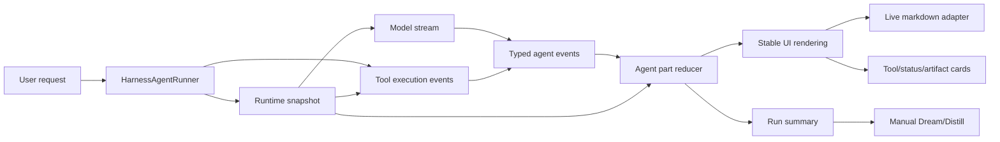

# Agent Runtime Stability and Manual Dream/Distill Design

Date: 2026-06-14
Status: Approved for planning

## Goal

Improve LingMo agent execution so skill runs, MCP tools, tool permissions, long-form writing, and generated artifacts feel continuous, stable, and explainable.

The target behavior is:

- visible progress starts quickly after the user submits a task
- Skill and MCP tools exposed to the model are predictable for each run
- permission, authentication, and missing-tool states are shown as structured runtime states, not surprise failures
- tool calls do not flash between failed/running/succeeded states
- recoverable tool errors are shown as recoverable steps, not full run failures
- generated articles, daily reports, and files stream smoothly
- malformed or partial stream fragments do not leak as garbled user-facing text
- manual Dream and Distill flows can extract memory and reusable workflows without background automation

## Current Scope

This design intentionally does not add Compose orchestration mode. Compose patterns from MiMo-Code are useful future references, but the current scope is smaller:

1. Stabilize Skill/MCP runtime exposure, permissions, and state.
2. Stabilize agent streaming and tool lifecycle display.
3. Add manual Dream and Distill triggers.
4. Leave automatic Dream/Distill scheduling for a later iteration.

## Reference Patterns From MiMo-Code

MiMo-Code is stable because its UI does not render raw model text as the source of truth. Its session processor converts model output into typed events and durable message parts:

- reasoning start, delta, end
- text start, delta, end
- tool input start, tool call, tool result, tool error
- step start, step finish
- finish, retry, overflow, abort

The UI renders those stable parts instead of guessing state from the latest text chunk. Live markdown is also healed and split safely so unfinished code fences or references do not destabilize rendering.

MiMo-Code's runtime design also separates discovery from execution:

- Skill discovery loads metadata first, then loads content and files only when selected.
- Skill tools are permission-gated before use.
- MCP servers have explicit lifecycle states such as connected, disabled, pending, failed, and auth-needed.
- MCP tool definitions are cached and refreshed through tool-change notifications.
- Dream consolidates durable memory from prior session traces.
- Distill identifies repeated workflows and packages them into reusable skills, agents, or commands.

LingMo already has useful pieces: `AgentEventBus`, `ToolCall`, `AgentActivity`, `streaming-smoother`, tool governance, final-answer validation, `AgentMiddlewareRuntime`, `skillManager`, MCP stores, working memory, and run summaries. The missing piece is a single canonical runtime snapshot and state reducer between model/tool events and UI state.

## Current LingMo Issues

The current flow has multiple writers updating overlapping UI fields:

- `onThought` updates `currentThought`
- `onAction` updates `currentAction`
- `onObservation` updates `currentObservation`
- `onAnswerDelta` clears thought/action/observation and switches to answer mode
- `handleAgentEvent` separately replays event history into telemetry and activity
- `createSkillMcpMiddleware` dynamically filters visible tools per model step
- MCP store and MCP manager infer server health from partial connected/error state

This makes the UI vulnerable to race-like visual jumps. A tool failure can be rendered as a run failure even if the agent later recovers. A final-answer delta can hide active tool state. A tool that is not in the current harness exposure can be attempted and shown as a hard failure even when the runtime could explain the missing capability before the call.

The UTF-8 symptom reported for skill scripts likely comes from native script output being decoded as strict UTF-8. If a script emits bytes in another encoding, binary bytes, or terminal control output, the harness can mark the script as failed even though the script continues or writes its artifact successfully.

The MCP/firecrawl symptom (`Cannot read properties of undefined (reading 'isError')`) indicates that MCP tool results are not normalized consistently before UI and harness code read them. Missing or malformed tool results should be converted into structured tool errors, never raw JavaScript exceptions in the user-facing stream.

## Recommended Architecture

Adopt a LingMo runtime snapshot plus part/event state model inspired by MiMo-Code, without replacing the whole agent runner at once.

### 1. Unified Runtime Snapshot

Add a canonical runtime snapshot produced before each run and refreshed at safe lifecycle points:

```ts
type AgentRuntimeSnapshot = {
  runId: string
  createdAt: number
  skills: SkillRuntimeSnapshot
  mcp: McpRuntimeSnapshot
  tools: ToolExposureSnapshot
  permissions: RuntimePermissionSnapshot
  warnings: RuntimeWarning[]
}
```

The snapshot becomes the source of truth for:

- selected and matched skills
- skill source, base directory, references, scripts, and allowed tools
- selected MCP servers
- MCP server lifecycle status
- cached MCP tool definitions
- visible tool names for the current run
- blocked tools and the reason they are blocked
- warning states that should not fail the whole run

`AgentMiddlewareRuntime` should bind this snapshot to the run and pass it through `beforeModel`, `beforeTool`, `afterTool`, and `afterRun`. The UI should be able to inspect the same snapshot so users can see why a tool is visible, hidden, blocked, or waiting for auth.

### 2. Skill Runtime Hardening

Skill discovery should remain metadata-first, but it should expose richer runtime facts:

- source: project, global, bundled, or future remote
- base directory and main file path
- whether the skill is user-invocable
- whether the skill is hidden/internal
- scripts, references, and assets counts
- allowed tool names
- validation warnings

Skill execution should not treat output-decoding problems as immediate run failures. Script execution should return exit code, decoded stdout/stderr, warnings, artifact evidence when available, and output encoding diagnostics.

### 3. MCP Runtime Hardening

MCP should use an explicit server status union:

```ts
type McpServerRuntimeStatus =
  | 'disabled'
  | 'pending'
  | 'connecting'
  | 'connected'
  | 'failed'
  | 'needs_auth'
  | 'needs_permission'
```

Each server snapshot should include:

- last connection attempt
- last successful connection
- last error
- auth or permission requirement
- cached tool count
- normalized tool definitions
- whether tools are stale

Tool-list refresh should be idempotent. Failed MCP refreshes should keep the last good tool cache when safe, while surfacing a stale-cache warning. Tool-call results should always be normalized into `{ content, isError }` before any caller reads `isError`.

### 4. Canonical Agent Parts

Add a canonical stream state in the agent layer:

```ts
type AgentPart =
  | ReasoningPart
  | TextPart
  | ToolPart
  | StatusPart
  | ErrorPart
  | CheckpointPart
  | ArtifactPart
```

Each part has a stable `id`, `runId`, `status`, timestamps, and display visibility. Tool parts represent pending, running, success, error, skipped, cancelled, retryable, blocked, and stale states.

The current `AgentEventBus` remains, but UI should derive live display from parts, not from `currentThought/currentAction/currentObservation`.

### 5. Agent Event Reducer

Introduce one reducer that consumes agent events and produces:

- `parts`
- `activity`
- `telemetry`
- `finalAnswerContent`
- `visibleStatus`
- `recoverableErrors`
- `fatalErrors`
- `runtimeSnapshot`

The reducer becomes the only place that decides whether the visible status says "thinking", "calling tool", "tool step failed, recovering", "writing answer", "waiting for permission", or "done".

Existing direct callbacks can remain during migration, but they should write through the reducer instead of mutating several fields independently.

### 6. Explicit Tool Lifecycle

Tool state should be visible before execution begins:

1. runtime snapshot decides whether the tool is visible
2. `tool-input-start` or `action.parsed` creates a pending tool part
3. `beforeTool` may move it to blocked, waiting-for-confirmation, or running
4. `tool.execution.started` moves it to running
5. `tool.execution.finished` moves it to success, error, retryable, or stale
6. recoverable errors stay attached to the tool part and do not automatically mark the whole run failed
7. final run failure is reserved for unrecoverable model/runtime errors

This directly addresses the "frontend says failed, but file appears later" issue. The UI should show "script output warning, checking artifact" when the tool error is recoverable or artifact-producing.

### 7. Stream-Safe Answer Rendering

Add a markdown live renderer adapter similar to MiMo-Code's live markdown stream handling:

- heal incomplete markdown while streaming
- keep unfinished code fences in live mode
- avoid rendering half-parsed JSON/action fragments as visible answer text
- only switch to full markdown rendering after `text-end` or final answer completion

LingMo's existing `streaming-smoother` can remain as the pacing layer. The new renderer should control what is safe to display, while the smoother controls how quickly it appears.

### 8. Manual Dream

Manual Dream should create proposed memory entries from existing durable data, not raw hallucinated summaries.

Data sources:

- `AgentRunSummary`
- stable agent parts
- tool usage and failures
- files touched
- working memory
- existing memory entries
- imported LLM-memory sessions when available

Output:

- memory candidates grouped by type: preference, project fact, workflow lesson, failure lesson
- evidence references back to run summaries or files
- confidence
- write target
- review status

Dream should not auto-write by default. The first version should let the user review and accept candidates before writing to the memory store.

### 9. Manual Distill

Manual Distill should identify repeated workflows and recommend reusable assets.

Data sources:

- run summaries
- skill usage
- tool usage patterns
- repeated user prompts
- recurring failures and recoveries
- file templates and generated artifacts

Output:

- recommended workflow name
- trigger examples
- reusable steps
- required tools
- candidate skill/template/command shape
- risk and verification notes

The first version should generate recommendations and optional drafts only after explicit user action. It should not auto-create or auto-enable new skills.

## Data Flow



## Migration Plan

Phase 1: Stabilize existing flow.

- add `AgentPart` types and a reducer alongside existing state
- map current event types into parts
- make live agent status read the reducer snapshot
- keep old fields as compatibility output

Phase 2: Add runtime snapshot foundation.

- add `AgentRuntimeSnapshot` types
- build skill snapshot from `skillManager`
- build MCP snapshot from MCP store and server manager
- build tool exposure snapshot from selected tools and runtime policy
- bind snapshot to each run through `AgentMiddlewareRuntime`

Phase 3: Make tools first-class parts.

- create pending tool parts as soon as a tool call is parsed
- distinguish blocked, pending, running, success, error, stale, and retryable tool states
- distinguish recoverable tool errors from fatal agent errors
- show skipped and retryable tool calls as normal lifecycle states
- persist part history in run summaries

Phase 4: Harden Skill and MCP execution.

- decode script output with replacement
- surface encoding warnings in tool detail
- validate success by exit code plus artifact evidence
- normalize MCP tool results before UI/harness access
- add explicit MCP server lifecycle states
- keep last good MCP tool cache when refresh fails safely

Phase 5: Smooth answer rendering.

- add live markdown adapter
- render streaming text through safe blocks
- only commit final markdown after final answer completion
- reduce scroll triggers to part-level changes instead of every thought chunk

Phase 6: Add manual Dream.

- collect run-summary and memory evidence
- generate reviewable memory candidates
- add accept/reject/write flow
- persist accepted entries through the existing memory store

Phase 7: Add manual Distill.

- detect repeated workflows from summaries and tool usage
- generate reusable workflow recommendations
- optionally draft skill/template files only after explicit user action

## Error Handling

Recoverable errors:

- invalid UTF-8 output with successful exit
- skipped extra tool calls
- transient web/MCP/firecrawl tool failure
- stale MCP tool cache with last known valid definitions
- missing optional tool capability
- tool output too large
- model final answer rejected by validation
- Dream/Distill candidate extraction failure for one source

Fatal errors:

- run cancellation
- missing required credentials with no fallback
- tool process non-zero exit without artifact or usable output
- MCP tool required for the task is unavailable and no fallback exists
- unhandled runner exception
- memory write failure after the user accepted a Dream candidate

Recoverable errors should keep the run in `running` status and display a tool-level warning. Fatal errors can set the run to `error`.

## Testing

Add focused tests before broad UI changes:

- runtime snapshot lists visible, blocked, and warning tools
- skill snapshot includes source, base directory, allowed tools, and validation warnings
- MCP snapshot maps pending/connected/failed/needs-auth states
- MCP malformed results are normalized and never throw on `isError`
- event reducer maps tool pending/running/success/error/blocked correctly
- recoverable tool error does not mark run fatal
- final answer delta does not erase active tool state
- invalid UTF-8 script output is decoded with replacement and recorded as warning
- live markdown renderer handles unfinished code fences and links
- streaming smoother still advances promptly on first visible content
- Dream generates reviewable candidates with evidence
- Distill generates workflow recommendations without writing files by default

Smoke verification:

- run an agent task that calls a skill script and writes a file
- run a long article/report generation task
- run a tool failure followed by recovery
- run an MCP server refresh failure with last good tool cache
- manually trigger Dream and accept one memory candidate
- manually trigger Distill and inspect recommendations
- confirm UI stays stable and final artifact is visible

## Non-Goals

- Do not add Compose orchestration mode in this iteration.
- Do not replace the whole agent runner in one pass.
- Do not introduce a new model provider or external orchestration framework.
- Do not auto-schedule Dream or Distill.
- Do not auto-create or auto-enable new skills from Distill output.
- Do not change skill authoring format unless needed for output encoding guidance.
- Do not remove existing agent history until the new part snapshot is persisted.

## Acceptance Criteria

- A skill script can produce a file while the UI shows one continuous lifecycle.
- Invalid UTF-8 script output does not crash the visible tool call if the run can recover.
- Tool failures are shown as tool-level states unless they are truly fatal.
- MCP unavailable/auth/permission states are visible before tool execution.
- The model cannot call tools outside the current runtime snapshot without a structured blocked state.
- Long generated content streams without raw JSON/action fragments or malformed markdown artifacts.
- Agent status labels do not rapidly flip between thinking/tool/answering for the same step.
- Manual Dream produces reviewable memory candidates with evidence.
- Manual Distill produces reusable workflow recommendations without automatic side effects.
