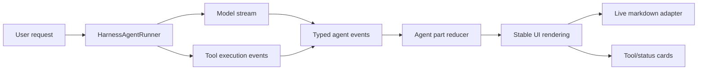

# Agent Stream Stability Design

Date: 2026-06-14
Status: Approved for planning

## Goal

Improve LingMo agent execution so skill runs, tool calls, and long-form writing feel continuous, stable, and explainable. The target behavior is:

- visible progress starts quickly after the user submits a task
- tool calls do not flash between failed/running/succeeded states
- recoverable tool errors are shown as recoverable steps, not full run failures
- generated articles, daily reports, and files stream smoothly
- malformed or partial stream fragments do not leak as garbled user-facing text

## Reference Pattern From MiMo-Code

MiMo-Code is stable because its UI does not render raw model text as the source of truth. Its session processor converts model output into typed events and durable message parts:

- reasoning start, delta, end
- text start, delta, end
- tool input start, tool call, tool result, tool error
- step start, step finish
- finish, retry, overflow, abort

The UI renders those stable parts instead of guessing state from the latest text chunk. Live markdown is also healed and split safely so unfinished code fences or references do not destabilize rendering.

LingMo already has useful pieces: `AgentEventBus`, `ToolCall`, `AgentActivity`, `streaming-smoother`, tool governance, and final-answer validation. The missing piece is a single canonical state reducer between model/tool events and UI state.

## Current LingMo Issues

The current flow has multiple writers updating overlapping UI fields:

- `onThought` updates `currentThought`
- `onAction` updates `currentAction`
- `onObservation` updates `currentObservation`
- `onAnswerDelta` clears thought/action/observation and switches to answer mode
- `handleAgentEvent` separately replays event history into telemetry and activity

This makes the UI vulnerable to race-like visual jumps. A tool failure can be rendered as a run failure even if the agent later recovers. A final-answer delta can hide active tool state. Scroll and live markdown updates can also fire too often during dense streams.

The UTF-8 symptom reported for skill scripts likely comes from native script output being decoded as strict UTF-8. If a script emits bytes in another encoding, binary bytes, or terminal control output, the harness can mark the script as failed even though the script continues or writes its artifact successfully.

## Recommended Approach

Adopt a LingMo part/event state model inspired by MiMo-Code, without replacing the whole agent runner at once.

### 1. Canonical Agent Parts

Add a canonical stream state in the agent layer:

```ts
type AgentPart =
  | ReasoningPart
  | TextPart
  | ToolPart
  | StatusPart
  | ErrorPart
  | CheckpointPart
```

Each part has a stable `id`, `runId`, `status`, timestamps, and display visibility. Tool parts represent pending, running, success, error, skipped, cancelled, and retryable states.

The current `AgentEventBus` remains, but UI should derive live display from parts, not from `currentThought/currentAction/currentObservation`.

### 2. Agent Event Reducer

Introduce one reducer that consumes agent events and produces:

- `parts`
- `activity`
- `telemetry`
- `finalAnswerContent`
- `visibleStatus`
- `recoverableErrors`

The reducer becomes the only place that decides whether the visible status says "正在调用工具", "工具步骤失败，正在恢复", "正在写答案", or "完成".

Existing direct callbacks can remain during migration, but they should write through the reducer instead of mutating several fields independently.

### 3. Explicit Tool Lifecycle

Tool state should be visible before execution begins:

1. `tool-input-start` or `action.parsed` creates a pending tool part.
2. `tool.execution.started` moves it to running.
3. `tool.execution.finished` moves it to success or error.
4. recoverable errors stay attached to the tool part and do not automatically mark the whole run failed.
5. final run failure is reserved for unrecoverable model/runtime errors.

This directly addresses the "frontend says failed, but file appears later" issue. The UI should show "脚本输出解码失败，正在检查产物/尝试恢复" when the tool error is recoverable or artifact-producing.

### 4. Stream-Safe Answer Rendering

Add a markdown live renderer adapter similar to MiMo-Code's `markdown-stream.ts`:

- heal incomplete markdown while streaming
- keep unfinished code fences in live mode
- avoid rendering half-parsed JSON/action fragments as visible answer text
- only switch to full markdown rendering after `text-end` or final answer completion

LingMo's existing `streaming-smoother` can remain as the pacing layer. The new renderer should control what is safe to display, while the smoother controls how quickly it appears.

### 5. UTF-8 and Script Output Hardening

Skill script execution should treat stdout/stderr as bytes first:

- decode as UTF-8 with replacement instead of fatal failure for UI logs
- preserve a raw/truncated diagnostic when invalid bytes appear
- classify invalid encoding as a tool output warning when the process exits successfully
- do not mark the whole run failed before checking exit code and produced artifacts
- recommend scripts emit UTF-8 explicitly, but do not rely on that for stability

This protects report/article generation tasks from failing visually because one script printed non-UTF-8 bytes.

## Data Flow



## Migration Plan

Phase 1: Stabilize existing flow.

- add `AgentPart` types and a reducer alongside existing state
- map current event types into parts
- make `AgentExecutionStatus` read the reducer snapshot
- keep old fields as compatibility output

Phase 2: Make tools first-class parts.

- create pending tool parts as soon as a tool call is parsed
- distinguish recoverable tool errors from fatal agent errors
- show skipped and retryable tool calls as normal lifecycle states
- persist part history in `agentHistory`

Phase 3: Smooth answer rendering.

- add live markdown adapter
- render streaming text through safe blocks
- only commit final markdown after final answer completion
- reduce scroll triggers to part-level changes instead of every thought chunk

Phase 4: Harden script output.

- decode script output with replacement
- surface encoding warnings in tool detail
- validate success by exit code plus artifact evidence
- add targeted tests for invalid UTF-8 script output

## Error Handling

Recoverable errors:

- invalid UTF-8 output with successful exit
- skipped extra tool calls
- transient web/MCP/firecrawl tool failure
- tool output too large
- model final answer rejected by validation

Fatal errors:

- run cancellation
- missing required credentials with no fallback
- tool process non-zero exit without artifact or usable output
- unhandled runner exception

Recoverable errors should keep the run in `running` status and display a tool-level warning. Fatal errors can set the run to `error`.

## Testing

Add focused tests before broad UI changes:

- event reducer maps tool pending/running/success/error correctly
- recoverable tool error does not mark run fatal
- final answer delta does not erase active tool state
- invalid UTF-8 script output is decoded with replacement and recorded as warning
- live markdown renderer handles unfinished code fences and links
- streaming smoother still advances promptly on first visible content

Smoke verification:

- run an agent task that calls a skill script and writes a file
- run a long article/report generation task
- run a tool failure followed by recovery
- confirm UI stays stable and final artifact is visible

## Non-Goals

- Do not replace the whole agent runner in one pass.
- Do not introduce a new model provider or external orchestration framework.
- Do not change skill authoring format unless needed for output encoding guidance.
- Do not remove existing agent history until the new part snapshot is persisted.

## Acceptance Criteria

- A skill script can produce a file while the UI shows one continuous lifecycle.
- Invalid UTF-8 script output does not crash the visible tool call if the run can recover.
- Tool failures are shown as tool-level states unless they are truly fatal.
- Long generated content streams without raw JSON/action fragments or malformed markdown artifacts.
- Agent status labels do not rapidly flip between thinking/tool/answering for the same step.
