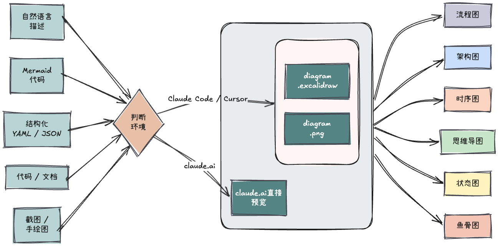

# excalidraw-diagram Skill

一个 Claude Code / Claude Desktop Skill，把自然语言、Mermaid 代码、代码文档或截图转换成**手绘风格**的 Excalidraw 图表。



📖 [English version](./README.en.md)

---

### 支持的图类型

| 类型 | 适用场景 | 示例提示 |
|---|---|---|
| **流程图** | 业务流程、用户旅程、决策树 | "画一个用户注册流程图" |
| **架构图** | 系统架构、微服务、云基础设施 | "画出这个系统的后端架构" |
| **时序图** | API 调用链、服务间交互、认证流程 | "画出 OAuth2.0 授权码流程" |
| **思维导图** | 头脑风暴、概念拆解、知识梳理 | "把这个主题展开成思维导图" |
| **状态图** | 状态机、订单生命周期、审批流 | "画出订单的状态转换图" |
| **鱼骨图** | 根因分析、问题溯源 | "画一个线上故障根因分析鱼骨图" |

### 安装

**claude.ai**：

1. 下载代码 zip → 上传到 claude.ai 安装
2. Claude Settings → 连接器 → 搜索 Excalidraw → 连接

> Skill 提供绘图指令，Connector 提供 `create_view` 渲染工具，两者缺一不可。
> claude.ai 路径仅支持紧凑 spec（≤ 6 节点），不支持本地 Mermaid 转换工具。

**Claude Code / Cursor**（本地文件输出，推荐）：

```bash
git clone https://github.com/yijingjia/excalidraw-diagram-skill \
  ~/.claude/skills/excalidraw-diagram-skill

cd ~/.claude/skills/excalidraw-diagram-skill/tools
npm install   # 首次运行会下载 ~170MB Chromium，之后复用
```

离线 / 网络受限，改用系统 Chrome：

```bash
PUPPETEER_SKIP_DOWNLOAD=1 npm install
export PUPPETEER_EXECUTABLE_PATH="/Applications/Google Chrome.app/Contents/MacOS/Google Chrome"
```

### 使用

直接和 Claude 对话即可触发：

> "画一个用户登录流程图"
> "把这个 Mermaid 转成 Excalidraw"
> "画出这段代码的调用关系"
> "帮我把这张手绘架构图数字化"

输出两个文件到当前目录：

```
oauth-flow-20260423/
├── diagram.excalidraw   # 可编辑源文件
└── diagram.png          # 预览图
```

### 打开 / 编辑生成的文件


| 工具                                                                                                                             | 说明                               |
| ------------------------------------------------------------------------------------------------------------------------------ | -------------------------------- |
| [excalidraw.com](https://excalidraw.com)                                                                                       | 网页版，菜单 → Open → 选择 `.excalidraw` |
| [VS Code / Cursor 插件 `pomdtr.excalidraw-editor`](https://marketplace.visualstudio.com/items?itemName=pomdtr.excalidraw-editor) | 安装后直接双击文件打开                      |
| [Obsidian Excalidraw 插件](https://github.com/zsviczian/obsidian-excalidraw-plugin)                                              | 在 vault 中打开，支持嵌入笔记               |


### 致谢

`tools/vendor/svg-to-excalidraw-src/` 包含来自 [excalidraw/svg-to-excalidraw](https://github.com/excalidraw/svg-to-excalidraw)（MIT 协议）的源码，详见 [NOTICE](./NOTICE)。

### 许可证

MIT