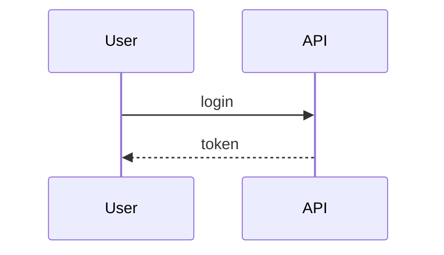
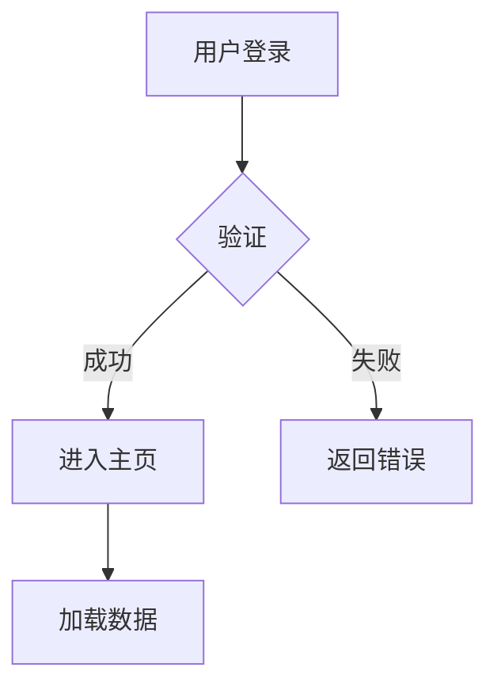

# Mermaid → Excalidraw 转换规则

用户提供 Mermaid 代码时（或 Claude 内部先生成 Mermaid 作为中间格式），按这套规则转成 Excalidraw elements。

---

## Mermaid 图类型识别

看 Mermaid 代码的第一行，决定用哪个 layout：

| Mermaid 开头 | 图类型 | 使用的 layout reference |
|---|---|---|
| `graph TD` / `graph TB` / `flowchart TD` | 流程图（垂直）| `layout-flowchart.md` |
| `graph LR` / `flowchart LR` | 流程图（水平）| `layout-flowchart.md`（横向调整）|
| `sequenceDiagram` | 时序图 | `layout-sequence.md` |
| `classDiagram` | 类图 | 降级到 architecture |
| `stateDiagram` / `stateDiagram-v2` | 状态图 | MVP 不支持，告知用户 |
| `erDiagram` | ER 图 | MVP 不支持，告知用户 |
| `mindmap` | 思维导图 | MVP 不支持，告知用户 |
| `journey` | 用户旅程 | 降级到 flowchart |

---

## 节点形状映射（flowchart）

Mermaid 语法 `A[text]` 里括号的形状决定节点样式：

| Mermaid 语法 | Excalidraw 类型 | 配色语义 |
|---|---|---|
| `A[方框]` | `rectangle` | 业务紫（默认）|
| `A(圆角方框)` | `rectangle` + `roundness: {type: 3}` | 业务紫 |
| `A([圆角胶囊])` | `rectangle` + `roundness: {type: 3}` + 更大 roundness | 业务紫 |
| `A{菱形}` | `diamond` | 决策黄 |
| `A{{六边形}}` | `diamond`（降级）| 决策黄 |
| `A[(圆柱/数据库)]` | `rectangle` + 数据青色 | 数据青 |
| `A((圆形))` | `ellipse` | 用户蓝（典型是 actor）|
| `A>旗帜]` | `rectangle` + `roundness` | 中性灰 |
| `A[/平行四边形/]` | `rectangle`（降级）| 中性灰 |

**注**：Excalidraw 没有六边形、平行四边形、圆柱，都用最接近的形状代替。

---

## 节点 ID 和 Label 解析

```
A[处理用户请求]
```

解析规则：
- `A` → 转为 `n-a` 或保留原 id（只要全局唯一）
- `[处理用户请求]` → 这是 `label.text`

**注意**：Mermaid 的 id 短（单字母），但 Excalidraw 里用更具描述性的 id 更好，比如 `n-process-request`。如果原文短且唯一，保留也行。

---

## 边（连线）映射

| Mermaid 语法 | Excalidraw arrow 配置 |
|---|---|
| `A --> B` | 实线箭头 |
| `A --- B` | 实线无箭头（`endArrowhead: null`）|
| `A -.-> B` | 虚线箭头（`strokeStyle: "dashed"`）|
| `A ==> B` | 粗箭头（`strokeWidth: 4`）|
| `A -->|label| B` | 带 label 的箭头（`label: {text: "..."}`）|
| `A --x B` | 实线箭头末端是 X（降级为普通箭头）|
| `A --o B` | 实线箭头末端是圆（降级为普通箭头）|

### 箭头 binding

根据图的方向（TD / LR）决定默认 fixedPoint：

**TD / TB（从上到下）**：
- startBinding: `[0.5, 1]`（源节点底部）
- endBinding: `[0.5, 0]`（目标节点顶部）

**LR（从左到右）**：
- startBinding: `[1, 0.5]`（源节点右边）
- endBinding: `[0, 0.5]`（目标节点左边）

**BT / RL（反向）**：互换即可。

---

## Subgraph（子图分组）

```mermaid
subgraph Frontend
  web[Web App]
  mobile[Mobile App]
end
```

→ 转为 Excalidraw 的 **背景 zone 矩形**：

```json
{
  "type": "rectangle",
  "backgroundColor": "#dbe4ff",
  "fillStyle": "solid",
  "opacity": 40,
  "strokeColor": "#4a9eed",
  "strokeWidth": 1,
  "roundness": { "type": 3 }
}
```

zone 的坐标要**包住所有子节点**：
- zone x = min(子节点 x) - 20
- zone y = min(子节点 y) - 40（留出 zone 标题空间）
- zone width = max(子节点 x + width) - zone x + 20
- zone height = max(子节点 y + height) - zone y + 20

zone 的标题（比如 "Frontend"）用独立 `text` 元素放在 zone 左上角内侧。

---

## 样式映射

### classDef（Mermaid 样式定义）

```mermaid
classDef userType fill:#a5d8ff,stroke:#4a9eed
class A,B userType
```

→ 把节点 A、B 的 `backgroundColor` 设为 `#a5d8ff`，`strokeColor` 设为 `#464650`。

直接把 Mermaid 里指定的颜色应用过去（不要强制套 skill 的语义色表）。

### 内联样式

```mermaid
style A fill:#ffc9c9
```

→ 单独设置该节点的 `backgroundColor: "#ffc9c9"`。

---

## 时序图语法映射

### 基本消息



| Mermaid | Excalidraw |
|---|---|
| `User->>API` | 实线箭头 |
| `User-->>API` | 虚线箭头（`strokeStyle: "dashed"`）|
| `User-)API` | 实线+空心箭头（`endArrowhead: "triangle"`）|
| `User-x API` | 实线箭头（Excalidraw 无 X 箭头，降级）|

冒号后的文字是 message 的 label。

### Actor / Participant

```mermaid
actor User
participant API
```

都转为 header rectangle。`actor` 可以用用户青绿（`#b8d4d4`），`participant` 用业务蓝（`#c3e0fe`）。

### Note

```mermaid
Note over API,DB: 事务处理
```

→ 画一个跨越 API 和 DB 两列的备注矩形（参见 `layout-sequence.md` 的 Note 章节）。

### Loop / Alt / Opt

```mermaid
loop 3 times
  ...
end

alt success
  ...
else failure
  ...
end
```

MVP 版本简化处理：
- `loop` 画成一个包围相关消息的虚线矩形，左上角标 "loop x3"
- `alt` 用分段横线分隔不同分支，标 "alt / else"

如果实现复杂可以暂时只转换主要消息，在图下方用文字说明"此处有 loop/alt 分支"。

---

## 完整转换示例

### 输入 Mermaid



### 转换步骤

1. **识别图类型**：`graph TD` → 垂直流程图
2. **提取节点**：
   - A: 方框 `用户登录`
   - B: 菱形 `验证`
   - C: 方框 `进入主页`
   - D: 方框 `返回错误`
   - E: 方框 `加载数据`
3. **提取边**：
   - A → B
   - B → C, label "成功"
   - B → D, label "失败"
   - C → E
4. **规划布局**：
   - A: x=300, y=40
   - B: x=310, y=140（diamond 居中）
   - C: x=100, y=280（左分支）
   - D: x=500, y=280（右分支）
   - E: x=100, y=400（接 C 之后）
5. **语义配色**：
   - A: 用户蓝（用户动作）
   - B: 决策黄
   - C: 成功绿
   - D: 错误红
   - E: 业务紫

### 输出 elements

```json
[
  { "type": "cameraUpdate", "width": 800, "height": 600, "x": 0, "y": 0 },
  { "type": "rectangle", "id": "n-a",
    "x": 300, "y": 40, "width": 200, "height": 60,
    "backgroundColor": "#a5d8ff", "fillStyle": "solid",
    "strokeColor": "#464650", "roundness": { "type": 3 },
    "label": { "text": "用户登录", "fontSize": 16 } },
  { "type": "arrow", "id": "e-ab",
    "x": 400, "y": 100, "width": 0, "height": 40,
    "points": [[0,0],[0,40]], "endArrowhead": "arrow",
    "startBinding": { "elementId": "n-a", "fixedPoint": [0.5, 1] },
    "endBinding": { "elementId": "n-b", "fixedPoint": [0.5, 0] } },
  { "type": "diamond", "id": "n-b",
    "x": 310, "y": 140, "width": 180, "height": 100,
    "backgroundColor": "#e8c0a8", "fillStyle": "solid",
    "strokeColor": "#464650", "roughness": 0,
    "label": { "text": "验证", "fontSize": 16, "strokeColor": "#6b3a2a" } },
  { "type": "arrow", "id": "e-bc",
    "x": 340, "y": 240, "width": -140, "height": 40,
    "points": [[0,0],[-140,40]], "endArrowhead": "arrow",
    "strokeColor": "#2d5c5c",
    "label": { "text": "成功", "fontSize": 14 },
    "startBinding": { "elementId": "n-b", "fixedPoint": [0.2, 1] },
    "endBinding": { "elementId": "n-c", "fixedPoint": [0.5, 0] } },
  { "type": "rectangle", "id": "n-c",
    "x": 100, "y": 280, "width": 200, "height": 60,
    "backgroundColor": "#548484", "fillStyle": "solid",
    "strokeColor": "#464650", "roughness": 0, "roundness": { "type": 3 },
    "label": { "text": "进入主页", "fontSize": 16, "strokeColor": "#ffffff" } },
  { "type": "arrow", "id": "e-bd",
    "x": 460, "y": 240, "width": 140, "height": 40,
    "points": [[0,0],[140,40]], "endArrowhead": "arrow",
    "strokeColor": "#b85050",
    "label": { "text": "失败", "fontSize": 14 },
    "startBinding": { "elementId": "n-b", "fixedPoint": [0.8, 1] },
    "endBinding": { "elementId": "n-d", "fixedPoint": [0.5, 0] } },
  { "type": "rectangle", "id": "n-d",
    "x": 500, "y": 280, "width": 200, "height": 60,
    "backgroundColor": "#ffc9c9", "fillStyle": "solid",
    "strokeColor": "#464650", "roughness": 0, "roundness": { "type": 3 },
    "label": { "text": "返回错误", "fontSize": 16, "strokeColor": "#6b1a1a" } },
  { "type": "arrow", "id": "e-ce",
    "x": 200, "y": 340, "width": 0, "height": 60,
    "points": [[0,0],[0,60]], "endArrowhead": "arrow",
    "startBinding": { "elementId": "n-c", "fixedPoint": [0.5, 1] },
    "endBinding": { "elementId": "n-e", "fixedPoint": [0.5, 0] } },
  { "type": "rectangle", "id": "n-e",
    "x": 100, "y": 400, "width": 200, "height": 60,
    "backgroundColor": "#c3e0fe", "fillStyle": "solid",
    "strokeColor": "#464650", "roughness": 0, "roundness": { "type": 3 },
    "label": { "text": "加载数据", "fontSize": 16 } }
]
```

---

## Claude 作为中间 Mermaid 生成器

当用户是纯自然语言（路径 D/E）时，Claude 可以先在**脑内**生成 Mermaid 骨架，不用写到输出里，直接按这个 Mermaid 走转换流程。好处：

1. **结构更清晰**：Mermaid 强制"节点 + 边"的思考
2. **坐标规划更简单**：Mermaid → Excalidraw 有明确规则可套
3. **跟用户沟通更顺**：如果结构需要确认，可以直接贴 Mermaid 给用户看

示例：
- 用户说："画一个 OAuth 的流程图"
- Claude 脑内生成 Mermaid：
  ```
  graph TD
    A[用户点击登录] --> B[重定向到授权服务器]
    B --> C{用户同意?}
    C -->|是| D[返回授权码]
    D --> E[换取 access token]
    C -->|否| F[返回错误]
  ```
- 按本文档转成 Excalidraw elements

**注意**：如果结构可能有歧义（OAuth 有多个版本、多种 flow），**在脑内 Mermaid 生成后、调 create_view 之前**先把 Mermaid 给用户确认一下，而不是画完了再改。

---

## 常见转换错误

| 错误 | 修正 |
|---|---|
| 把 Mermaid 的 subgraph 当成普通节点 | subgraph 应该转为 zone rectangle，包含子节点 |
| 节点 id 冲突（Mermaid 用 A、B，转换时都变成短 id）| Claude 自己加前缀 `n-` 区分 |
| Mermaid `-->|label|` 里的 label 丢失 | 记得把 label 赋给 arrow 的 `label.text` |
| Mermaid 的 `classDef` 颜色被 skill 语义色覆盖 | 优先用户指定的颜色，skill 语义色只在用户没指定时使用 |
| 双向箭头 `<-->` 被画成单向 | Excalidraw 里用 `startArrowhead: "arrow"` + `endArrowhead: "arrow"` |
